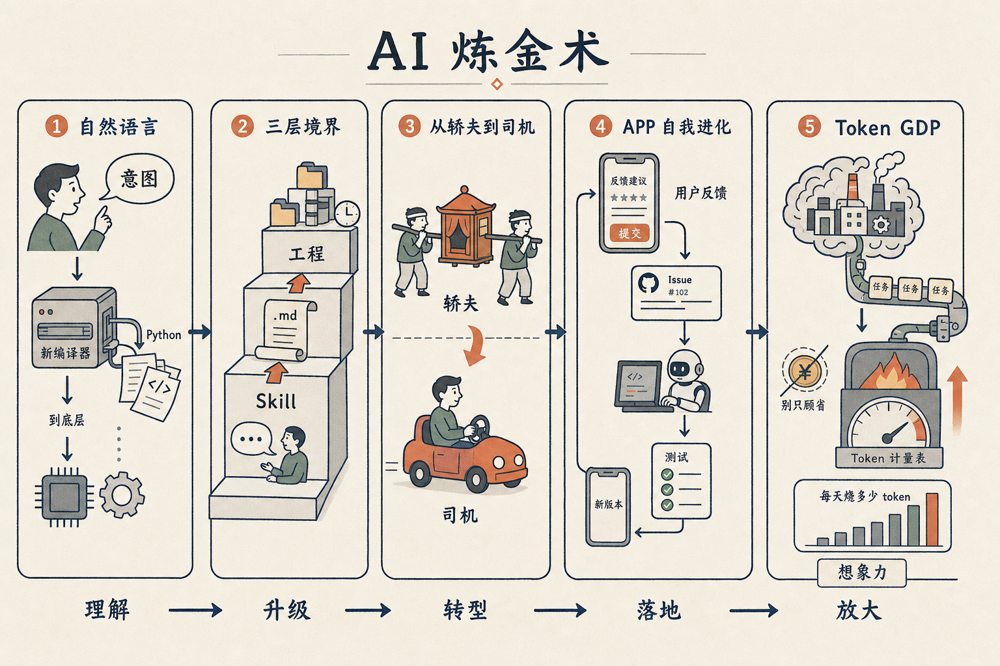

# AI 炼金术：和 Mars 聊了两小时，剪出 5 段

上周和 Mars 在 Riverside 录了一期对谈，主题叫《AI 炼金术》，两个小时。剪成了 5 段两分钟左右的精华，都传到了 YouTube 上。

每一段都可以独立看。下面是顺序和我的私房推荐看法。

## 一、LLM 是新的编译器，自然语言才是新代码

所谓「屎山代码」不是 bug，是新的汇编层——人不该读、不该改。

LLM 是新的编译器，把自然语言编译成 Python，再编译成汇编。未来你写的是「意图」，不是 Python。如果觉得生成的代码不对，去自然语言层改，不要在 Python 层改。

视频：https://www.youtube.com/watch?v=G-5naPKVgHM

## 二、用 AI 的三层境界——你停在第几层？

第一层：跟豆包 / ChatGPT 聊天。90% 的人卡在这一层。

第二层：写一个 .md 文件让它执行，沉淀成 skill。

第三层：用多个文件夹组织真正的工程项目，几万行自然语言「源代码」+ 定时执行。

只在第一层的人会觉得 AI「没法用」。真正的杠杆在第三层。

（这一层我之前单独写过一篇文字版，对应到编程的 REPL、单文件、多文件项目，可以回看公众号上一篇《AI 能力的三个简单层次》。）

视频：https://www.youtube.com/watch?v=zNFY8npEipA

## 三、程序员的最大风险——从轿夫到司机

AI 不是更快的轿子，是车。

程序员有力气抬轿子，但开车需要重新学。最大的悲哀：离新技术越近的产业工人，往往是被淘汰得最惨的——因为他们最不愿意承认自己原来的力气没用了。

视频：https://www.youtube.com/watch?v=TfSMIQOqmdU

## 四、我做了个 APP，它自己改自己

用户在 APP 里写反馈 → 自动提交到 GitHub Issue → Claude Code 写代码、跑测试、合并主分支 → TestFlight 5 分钟后推送新版本到你的手机。

未来软件的形态：不再从 App Store 下载现成的，每个 APP 都在按你的反馈自我进化。

视频：https://www.youtube.com/watch?v=VIcvO_iZf9U

## 五、Token 烧不出去，是因为你脑子不行

判断一个人或一家公司的 AI 真功夫，只看一个指标：每天烧多少 token。这是新的 GDP。

不要省 token——「省钱」会让你蒙蔽双眼，以为是钱的瓶颈，其实瓶颈是你的脑子、你的想象力、你能给 AI 派多少正经活。

视频：https://www.youtube.com/watch?v=7qYD5WGjXGY

## 完整版

5 段是从 2 小时里挑出来的，原版完整对谈也在 YouTube，搜「王建硕 Mars AI 炼金术」可以找到。如果你只有 10 分钟，就按顺序刷这 5 段。
