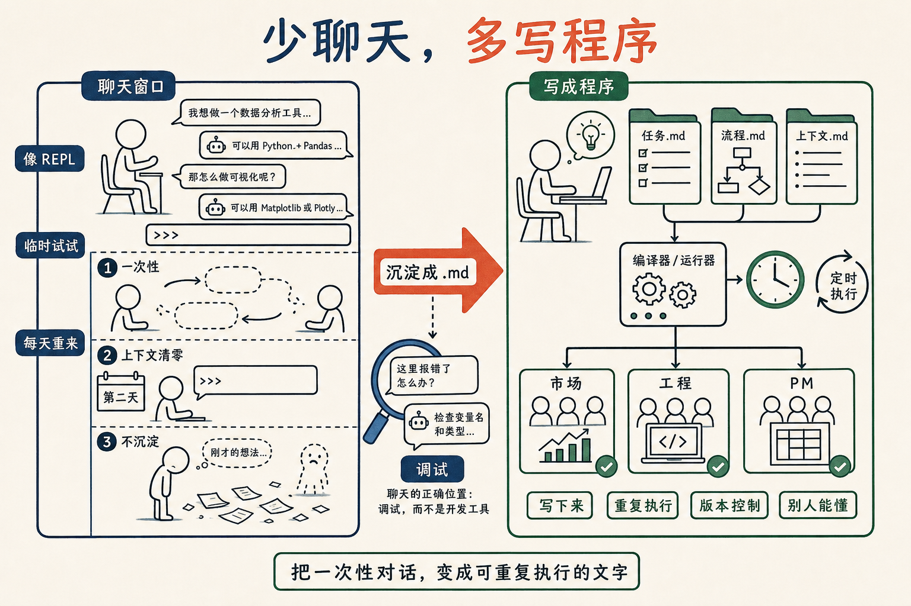

# 少跟 AI 聊天，多写程序

前两天和任鑫在茶馆里录播客，他来 diss 我，我也 diss 他，来来回回聊了两个小时。

中间有一个点，我自己越想越觉得是这一两年我对 AI 看法里**变化最大的一条**——

**少跟 AI 聊天，多写程序。**

## 程序员为什么"反感"AI？

我们聊到一件挺有意思的事——很多程序员对 AI 的态度，不是看不起、也不是看不懂，而是一种说不清的"反感"。

为什么？

我聊着聊着忽然想明白了：

**因为在程序员脑子里，"写一份代码、交给编译器去执行"——这才叫写程序。**

至于你打开一个聊天窗口，说一句他给你一堆，再说一句他再给你一堆——这件事在程序员的字典里**根本不叫程序**，这叫聊天。

我同意。我也认为这不叫程序。

程序的定义里有一个东西是必须的：**你写好的东西，由一个机器去把它一字不漏地执行出来。**

至于"你写好的东西"是汇编、是 C、是 Python、还是一段中文，无所谓。只要它是确定的、可以被机器重复执行的，它就叫程序。

而一句一句聊出来的对话，没有这个性质。

## 把 Python 直接打开回车

我打个最家常的比方。

装好 Python 之后，你直接在命令行敲 `python` 一回车，会进到一个交互式环境——每写一行立刻回车给你执行一行。

这个东西很好玩。初学者第一天会很爱用。

可是我这辈子没见过一个程序员真的在那里头**写出过任何有价值的程序**。

为什么？

因为这个东西**没法积累**。

你今天敲了 20 行，明天再敲 20 行，体力上跟不上，第三天就放弃了。

哪怕这 20 行真是好东西，它也没有被保存到一个文件里，没有被版本控制，没有被定时执行，没有跑过测试。它就这么发生了一下，然后过去了。

**我们今天大部分人和 AI 的聊天窗口，就是这个 Python REPL。**

每次开一个新对话，从零开始。聊得很愉快、很高效，问题"解决"了。

但你第二天打开它，所有上下文清零，又得从头再来一遍。

**这不是写程序。这是每天找一个新人，重新解释一遍同样的事。**

## 那"写程序"在 AI 时代长什么样？

最近这两周我有一个挺强烈的感觉——

**我又是一个程序员上岗了。**

而且我的工作习惯，和我过去 20 年做程序员时**几乎一模一样**：

写源代码 → 交给一个机器编译 → 设一个 schedule 定期执行 → 给我产生结果。

唯一的区别是，源代码不是 C，不是 Python，是 Markdown。是中文。是一个一个 `.md` 文件，按目录组织起来，描述这个程序应该干什么、需要什么 context、调用哪些 skill、产出什么。

然后我让大语言模型去编译它、执行它。

我有一个市场团队——每天早上 6 点干活。
我有一个工程团队——每 4 个小时醒一次干个活，有需求随时响应。
还有一个 PM 团队，正在搭。

这"团队"其实是什么？是我目录里的几个文件夹，里面是一堆 `.md` 文件，加上一个定时任务而已。

**写下来 + 重复执行 + 可以版本控制 + 别人能看懂 + 你自己改一处下次就跟着变**——这是程序的全部属性。

聊天窗口里那段神聊，**一条都不占**。

## 那聊天还有没有用？有，只有一个用处

聊天不是没用。它的位置非常清楚——

**聊天是一种非常快速的 debug 方法。**

你写好的"程序"（也就是那一堆 `.md`）跑出来不对、你不确定为什么、想试一下边界——这时候打开聊天窗口，一来一回快速摸清楚，是最高效的。

这正是当年我们用 Python REPL 的方式：写真正的程序在 `.py` 文件里；REPL 是为了快速试一下 `len(x)` 返回的到底是字节数还是字符数。

调试工具，不是开发工具。

所以如果你这一两个小时和 AI 聊得很愉快、解决了一个问题——**到最后一定要做一个动作**：让他把这一来一回的过程，**总结成一段文字**，存成一个 `.md`。

下次别人（包括以后的你自己）遇到同样的问题，直接调这个文件，不要再聊一遍。

聊完不沉淀，等于这一次的"调试"白做了。

## 所以

普通人，少跟 AI 聊天，多写程序。
程序员，少写代码，多写程序。

都一样——**多写 `.md`，少开聊天窗口。**

这件事说穿了不复杂：**从一次性的对话，变成可以重复执行的文字。**

但这是一次脑子的迁移。会疼。会让人下意识地退回那个"我开个聊天框问一下心里踏实"的旧世界。

我自己也在迁移。每次想偷懒打开聊天窗口，我现在会先问自己一句：

**这个东西，值不值得我把它写成一个 `.md`，让它每天都跑？**

如果值得，我就停下来去写那个文件。
如果不值得，我才去聊。

## 后注

这期播客是任鑫主持的《AI 炼金术》。前一篇我写了"Python 是新的汇编语言"，是同一场对话里的另一个角度。

两个角度其实是同一件事——

**人不需要在编译产物（汇编 / Python）那一层做事，人在源代码（自然语言 / `.md`）那一层做事。**

只不过上一篇讲的是"别在 Python 里改 bug"，这一篇讲的是"别在聊天窗口里写程序"。

correct me if I am wrong——欢迎拍砖。
