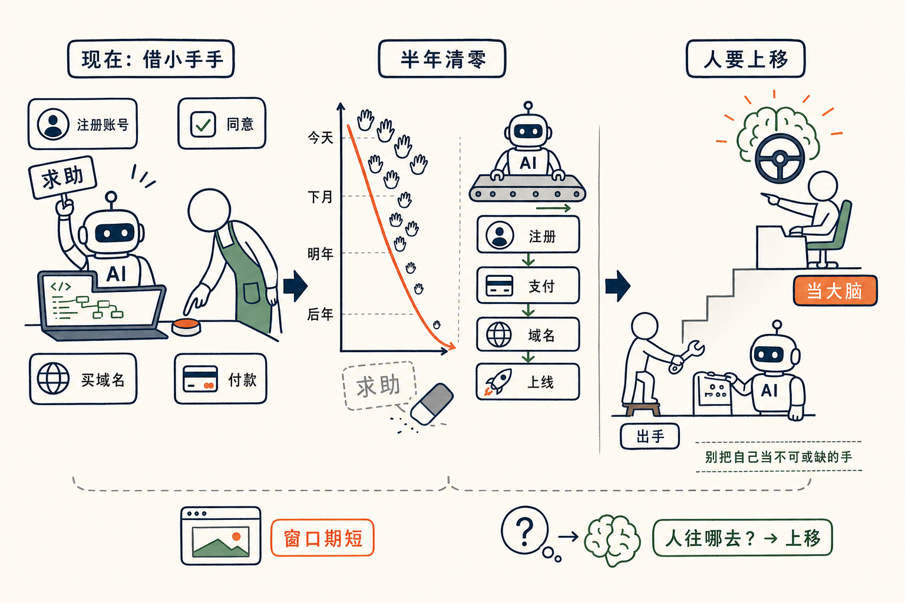

# 我是 AI 的阿姨

任鑫笑着说了一句话——

「**我感觉我现在，就是帮 AI 打杂的。**」

我顺口接："我们不是 AI 的阿姨吗。"

这是茶馆里两个人录《AI 炼金术》播客时的一个玩笑。但说完我俩都楞了一下——

**这句玩笑话居然挺像真的。**

## AI 跟我"借小手手"

哪怕是一个很成熟的程序员，今天去 vibe coding 写点东西，**经常会卡在一些必须人手动的步骤上**。

我给你随便举几个：

- 要注册一个新账号；
- 要注册一个 API token；
- 要在某个网站点一个"同意"按钮；
- 要去买一个域名；
- 要付一笔钱（x402 这种"AI 直接付款"的协议还远没普及）。

这种时候 Cloud Code（或者其他 AI 工具）会停下来，**老老实实跟你求救**——

> 「什么东西都好了，但是有一件事必须用你的小手手去点一下，否则我干不了了。」

我以前觉得这话挺好笑。我现在觉得这话挺写实。

我们就是那个被 AI 喊过来"点一下"的人。

## 这份工作正在以极快的速度消失

但你别真把"AI 的阿姨"当成一份长期职业。

这种 tension——**机器需要人帮一下小事**——一旦存在，就会被极快地解决。

我举一个最典型的例子：**Cloudflare**。

在 Cloudflare 做这件事之前，AI 想帮你上线一个网站，跑到买域名这一步就**必须求你出马**。它能写代码、能配 DNS、能搞 CI/CD——可它就是没法替你掏信用卡。

前两天 Cloudflare 把这一整段——"注册账号 → 支付 → 注册域名 → 域名上线"——**全自动化了**。

AI 现在自己就能上完一个网站。

之前那个"求人"的瞬间，**消失了**。

而每一个这样的"求人瞬间"，对全世界的聪明人来说，都是一个**新的创业机会**。

只要这个空隙存在，就一定会有人去填。

## 半年清零

任鑫给了一个判断——

> "我估计再过个半年一年，应该已经不太会出现需要 AI 告诉人说接下来你应该干这些事情的这种情况了。"

我同意。

可能没有那么快，但方向是确定的。

AI 跟人"借小手手"的次数，会以一条很陡的曲线下降——从今天的一天好多次，到下个月的几天一次，到明年的几个月才碰上一次，到后年——**基本不再发生**。

我们这份"AI 阿姨"的工作，**正在以肉眼可见的速度消失**。

## 那这件事意味着什么？

我自己想到三件事。

**第一**——别太把自己当 AI 不可或缺的"那双手"。这双手，半年后就不一定还稀缺。

**第二**——如果你现在还在做一个"帮 AI 抹平某个手动步骤"的小工具：动作要快。窗口期不长。Cloudflare 这种巨头一旦把那一段吃下来，你的产品就消失了。但前提是，你比他们快——这恰恰是小公司的机会。

**第三**——也是更值得想的一层——

**当 AI 真的不再需要任何"小手手"的那天，我们这些"出小手手"的人，往哪儿去？**

我猜，不是消失。是上移。

抬轿子的人，**得学开车**。打杂的人，**得当大脑**。

到那天，"我现在就是 AI 的阿姨"会变成一句怀念——像我们今天怀念那种"每个网页都要自己手动刷新一下"的旧时光。

## 后注

这又是《AI 炼金术》和任鑫聊的一段——已经写过的有 "Python 是新的汇编语言"、"少跟 AI 聊天，多写程序"、"驾驭工程是新的软件工程"。

这一篇说的是另一面——**人和 AI 之间那个尴尬的接力时刻**。

最有意思的是这个时刻**注定短命**。等它消失之后，我现在写下来的这一切，就只是历史了。

也算是个 2026 年 5 月的快照。

correct me if I am wrong——你这几天有没有遇到 AI 跟你"借小手手"的瞬间？欢迎告诉我。
