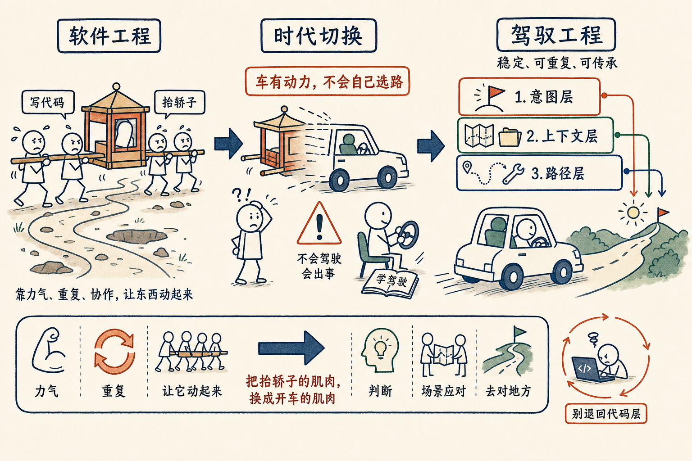

# 「驾驭工程」——程序员真正要学的新功课

「**离新技术越近的产业工人，往往是最惨的。**」

任鑫在录《AI 炼金术》播客的时候，扔出来这一句，把我打了一下。

我们在茶馆里聊到程序员和 AI 的关系，他举了一个我之前没想过的比方——

## 你是抬了十年轿子的轿夫，今天忽然有了车

在 AI 出来之前，**整个软件工程行业，其实是一群轿夫。**

我们抬着一个东西往前走，靠的是力气、技巧、节奏、协作。我们以为自己所有的努力都是为了"让这个东西往前走"。

但其实，**我们对这个东西也是有控制的**——它走哪条路、什么时候停、绕不绕过那个坑，都靠抬的人在心里默默校准。

我们觉得"走"是大事，"控制"是顺手做的小事。

然后忽然——轿子变成了**车**。

车往前走的动力，比我们这群轿夫加起来都强很多很多。

我们的第一反应是什么？

**我们天然就把"控制"也认为是车应该自己搞定的事。** "你这么大力气，方向你不会自己看吗？路你不会自己挑吗？"

但实际上——**这一层已经分离了。**

车有很大的 power，但你必须**学会开车**。

当你只会抬轿子、还没有学会开车的时候，这台车是不好用的。且不说他要把你带到什么地方去——**他不撞死人都很难。**

## 程序员最大的风险

抬轿子的工作，被驾驶员取代了。

但是——**驾驶员的工作，对于轿夫来说并不是天然就能适配的。**

轿夫也需要学。和其他**从来没抬过轿子的普通人一样**，他需要重新学**驾驶**这件事。

我现在看到的程序员，大致是这样——

**他们很有力气，但不太会驾驶。**

他们"抬轿子"的能力（写代码），正在被 AI 完全取代。可他们的"驾驶"能力，又因为各种各样情感上的别扭——这是我的手艺，这是我十年的功夫，这怎么可能交给一个机器——**蒙蔽了眼睛**。

使得他们学驾驶的**意愿，反而远远低于一个完全没碰过代码的普通人**。

这是程序员现在最大的风险。

很可能——当周围那些没学过编程、但已经把驾驶学得很好的人陆续出现的时候，程序员还封闭在"抬轿子"这件事里。

**然后被整个时代抛弃。**

离新技术越近，反而越惨。这件事我们已经看过太多次。

## 那"驾驶"具体长什么样？

得给它起个名字。

聊到这里的时候，我现想了一个词——**驾驭工程。**

（不用搜索，这是我刚造的词。）

它对应的就是过去几十年的"软件工程"。

软件工程是关于：在多人合作、长期维护的前提下，如何把一坨代码组织成可工程化的东西。MVC、面向对象、设计模式、版本控制——都是它的一部分。

驾驭工程，是关于：在大语言模型这台新的"机器"之上，如何把你的**意图**、**上下文**、**控制**这三层东西组织起来，让它**稳定地、可重复地、可传承地**产出你要的结果。

它至少包含三层——

- **意图层**：你到底要什么。不是"参观故宫"，而是"北京最有名、最让人印象深刻的景点"。
- **上下文层**：它需要知道什么。你公司的 VI、同事的脸、北京这个时间段会堵车。
- **路径层**：它该用什么方法。是坐地铁还是打车，是用 git 还是手工对比。

而到底**哪一层该交给 AI、哪一层人去做、哪一层让别人写好的 skill 来兜底**——这就是这门新学问的全部内容。

它现在还没有教科书，没有 MVC，没有 Gang of Four，没有 SICP。

**它就是刚刚开始的"软件工程"——只不过这一轮，地基从硅变成了大语言模型。**

## 不要再往代码层退一步

我现在的建议非常清楚——

**不要在代码层再浪费一分钟时间了。**

代码层不属于人类。

人类未来 10 年的精力，应该全部花在驾驭工程这个新学科上。这个东西可以耗尽你**所有的**时间。

你越是在代码层挣扎，你就越没有时间去优化你脑子里的那一层（意图 / 上下文 / 控制）；你的输入越糟糕，编译器给你的产物就越糟糕；产物越糟糕，你就越觉得"我还是得自己来改"——

死循环。

## 所以

你不是要"赶紧学 AI"。
你是要**赶紧把抬轿子的肌肉，换成开车的肌肉**。

这两件事，**不一样**——

- 抬轿子靠**力气**，开车靠**判断**。
- 抬轿子靠**重复**，开车靠**场景应对**。
- 抬轿子的目标是"让它动起来"，开车的目标是"让它去对地方"。

奇迹永远来自**那个迅速学会用枪的人**，而不是那个继续把武功练得更硬、去和枪较劲的人。

## 后注

这又是《AI 炼金术》和任鑫的一段。

上一篇我写的是"少跟 AI 聊天，多写程序"，再上一篇是"Python 是新的汇编语言"。三篇其实在说同一件事的三个面——

**人在源代码（自然语言）那一层做事，机器在编译产物（Python / 汇编）那一层做事；中间这件"把它们组织起来"的事，叫驾驭工程。**

correct me if I am wrong——你那边的「驾驶感」是什么样的，欢迎告诉我。
