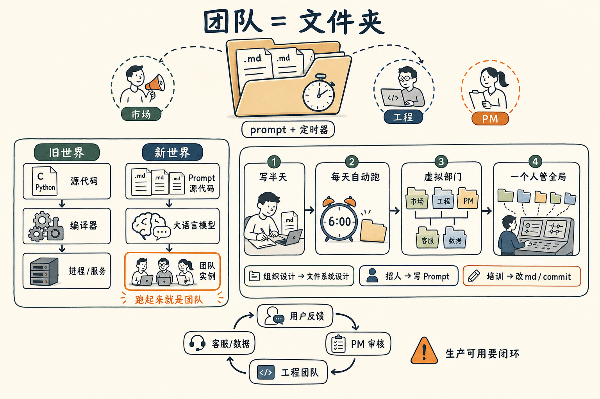

# 我新搭了一个市场团队——它是一个文件夹

最近我手上多了几个"团队"。

- 一个**市场团队**——每天早上 6 点钟开始干活。
- 一个**工程团队**——每 4 个小时醒一次干个活，有需求随时响应。
- 还有一个**PM 团队**，正在搭。

如果按传统的理解，你一定会想：又招了一波人？多少 head count？办公室够坐吗？工资从哪儿出？

都没有。

**这几个"团队"，每一个，就是我目录里的一个文件夹。**

里面是一堆 `.md` 文件，加上一个定时任务。

仅此而已。

## 这件事拆开看

我自己琢磨了一阵子，把这件事拆成了三层——

| 旧世界（写代码） | 新世界（写"团队"） |
|------------------|--------------------|
| 源代码（C / Python）| Prompt 源代码（一堆 `.md`）|
| 编译器（GCC / Python）| 大语言模型 |
| 跑起来的进程 / 服务 | 跑起来的 agent = "团队" |

最关键的是最右下角那一格——

**"实例"，就是"团队"。**

我们过去说"团队"，脑子里默认是十几个人坐在工位上、有 manager、要开站会、要争 head count。

现在不是了。

现在的"团队" = **一段 prompt 源代码 + 一个定时器**。

跑起来叫"团队"，停下来回到磁盘上，它就只是一个文件夹。

## 杠杆率高得吓人

这件事的杠杆率，比写软件还要高一档。

写普通软件的杠杆是——你写一次，N 个用户用。

写"团队"的杠杆是——**你写一次，它每天替你干活，不需要用户**。

我那个市场团队，**写它**大概花了我半个下午。然后它每天早上 6 点准时起床，开始干一些原本得我自己起床做的活：扫信息、发小红书、发 Twitter、发 Facebook……

每一次它运行，**我都不在场**。

而它做的事情，里面有不少在过去是要一句一句教一个真人去做的。教一个真人需要几周到几个月。教这个文件夹，**半个下午**。

任鑫一句话讲得很到位：

> "你那些很难的工程任务，对它来说就一句话。"

人当然是贪得无厌的。这一句话上完了——下一句话又来了。

## 那这意味着什么？

我自己想到几件事：

**第一**——组织设计，变成了**文件系统设计**。

你以前问"我的公司怎么组织"，答案是组织架构图、汇报关系、职级序列。今天问"我的公司怎么组织"，答案可能是"我的目录怎么组织、哪些文件夹放什么、用什么定时任务串起来"。

百姓网现在 158 个人——但如果你看我的工作目录，里面已经躺着十几个"虚拟的部门"。每个部门是一个文件夹。

**第二**——招人，变成**写 prompt**。

需要一个新职能？不用先招人。先写一个文件夹试试。等这个文件夹被人用了一段时间、跑出来的结果**真的有人用**，你再考虑要不要补一个真人去监管它。

**第三**——培训，变成 **git commit**。

我对一个"团队"不满意了——比如它发的小红书风格不对、用词太营销腔——我不用开会、不用一对一谈话、不用写 PIP。我直接打开它的 `.md`，改两行，commit。

下次它再跑，就是新版本。

## 但有一个红线得画

我一定要说一句不那么乐观的话——**不要以为写好文件夹就完事了。**

我那个 APP 现在每天加几个用户反馈，加几个新功能。但很多功能我用了不喜欢、又回去用 revert 按钮干掉。**完全打杂靶。**

这不是 AI 的正确使用方法。

真正可用的"团队"，至少还要再配两层——

- **PM 团队**（也是个文件夹）：在用户需求和工程团队之间做需求审核，过滤掉不靠谱的、不一致的。
- **客服 / 数据团队**（也都是文件夹）：把闭环打通，让"用户用了什么"反过来影响"团队要做什么"。

这些团队加在一起、在一个共同目标的统筹下开始工作——

**这才是真正生产环境可用的"组织"。**

而做这件事所需要的工作量，**等同于一个全职岗位**。

只不过这个全职岗位，**一个人就够了**。

## 所以

未来五年最有杠杆的一项技能，我觉得是——

**会写"团队级别的 prompt"。**

它不是简单的 prompt 工程（写一句话让 ChatGPT 给我个答案），而是——

把一份要做的事，写成一个文件夹里的若干 `.md`，组织好它们的关系，加上定时任务和 hook，让它**稳定地、可重复地、可传承地**替你工作。

然后这个文件夹里的"人"，**永远不离职，永远不抱怨，永远不要 head count，永远在跑**。

## 后注

这又是《AI 炼金术》和任鑫聊到的一个点。

之前几篇——"Python 是新的汇编"、"少跟 AI 聊天，多写程序"、"驾驭工程"、"我是 AI 的阿姨"——讲的都是个人和这台机器的关系。

这一篇上升一层——**组织和这台机器的关系**。

我猜未来一段时间，新一波"用 AI 重写公司"的人，干的就是这件事。不是把现有公司的某个岗位用 AI 替代，而是把"组织"这个东西本身，从 head count 重新写成文件夹。

correct me if I am wrong——你现在的工作里，有没有哪一块"团队"已经被你悄悄变成了一个文件夹？欢迎告诉我。
