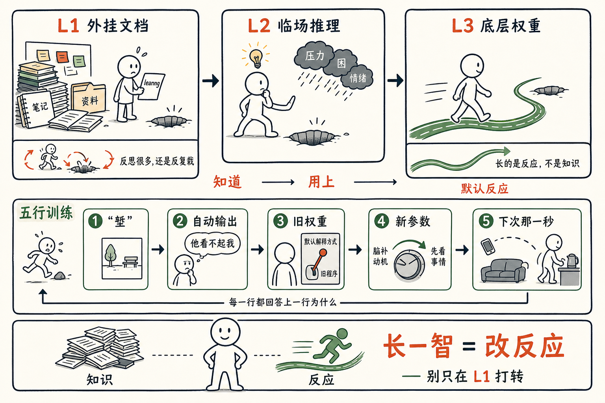

# 「吃一堑长一智」里的那个「智」，到底长在哪一层？

我笔记本里有两百多条 learning，每一条都是认真写下的「吃一堑长一智」。

可是有些堑，我栽过三次。每次栽完都郑重写一条 learning 进去。第四次还是会栽。

最近想明白了——这不是我不认真，是我**一直在错的那一层做这件事**。

## 任鑫给的那把尺子

前一阵和任鑫录播客，他给了我一把很好用的尺子——一个人可以从三层去改：

**L1 外挂文档。** 笔记、收藏、Obsidian 里的两百条 learning。最容易写，最有「我在进步」的感觉。但它**不在你脑子里**，关键那一秒它不在场。

**L2 临场推理。** 想起一条道理，慢一拍，把它用上。状态好时有，瞌睡一来、压力一上、对方一句戳到——就掉线。

**L3 底层权重。** 不假思索的第一反应。**这一层才是你。** L1 是你**希望成为**的人。

我那两百条 learning，全部在 L1。它们一条都没动过 L3。

所以同样的事再发生，触发的还是原来那条权重，输出的还是原来那个反应。

## 知道、用上、默认反应，是三件事

知道一条道理，读篇文章就够。

临场用上，难——情绪一来就忘。

变成默认反应，最难——它要改的不是想法，是反应本身。

我们大部分的「反思」停在第一件。少数到第二件。**几乎没人到第三件。**

但只有到第三件，你才能说「长了一智」。

否则你长的是知识，不是智。

## 一个 5 步的 skill

我和 Claude 一起做了一个 skill，叫 `wjs-eating-and-growing`。每次「吃堑」之后按 5 步走一遍，输出五行：

1. **堑** —— 发生的纯事实，不带解读
2. **自动输出** —— 那一秒脑子里实际蹦出来的那句话（不是事后总结）
3. **旧权重** —— 我**这个人**为什么对这一类事情默认这样反应
4. **新参数** —— 想训练的新模式，落到一类具体情境
5. **下次的那一秒** —— 触发器出现的那一秒，**具体做什么动作不一样**

一步一问。不许跳，不许合并，不许把 5 个问题一次性罗列让你一起答——人从情绪里走出来的速度是慢的，一次问五个，等于回到 L1 写笔记。

第 4 步的「新参数」要小到只针对一类情境（"遇到 X 时…"），不是"我要更成熟"这种决心。第 5 步的「动作」要小到 2 秒能完成、不依赖意志力——身体动作，不是念头。

五行写完，每一行往回问，都能接上一行的「为什么」。哪一行接不上，回那一步重写。



## 所以

这套五行不是反思。反思我已经做过太多次，反思整个发生在 L1。

它是想直接练那一秒的肌肉记忆——L3。

能不能成？我不敢保证。但有一点比较确定——

**只在 L1 反复打转，几乎一定不会成。** Obsidian 里那两百条 learning 是活证据。

我们这一生其实没那么多「道理」要学，常见的就那几十条。

但每一条，从知道到做到，可能要走很多年。

「长一智」这个词比我以为的重。它要长的不是知道，是反应。

## 安装方法

skill 在 [github.com/jianshuo/claude-skills](https://github.com/jianshuo/claude-skills)。先 clone：

```bash
git clone https://github.com/jianshuo/claude-skills.git
```

然后按你用的工具，拷到对应目录：

| 工具 | 命令 |
|---|---|
| Claude Code | `cp -r claude-skills/wjs-eating-and-growing ~/.claude/skills/` |
| Codex | `cp -r claude-skills/wjs-eating-and-growing ~/.codex/skills/` |
| OpenClaw | `cp -r claude-skills/wjs-eating-and-growing ~/.openclaw/skills/` |
| Kimi Code | `cp -r claude-skills/wjs-eating-and-growing ~/.config/agents/skills/` |
| Hermes | `hermes skills tap add jianshuo/claude-skills && hermes skills install wjs-eating-and-growing` |

装完重启对话，对它说一句「我想吃一堑长一智，最近这件事——」，就能用。

## 后注

底层框架来自任鑫（Mars）《庄子，业力和大模型》，从「庖丁解牛」"以神遇而不以目视"讲起，把"修行"翻译成"调权重"。强烈推荐去读原文。

skill 叫 `wjs-eating-and-growing`，github 上能找到。

correct me if I am wrong——欢迎拍砖。
