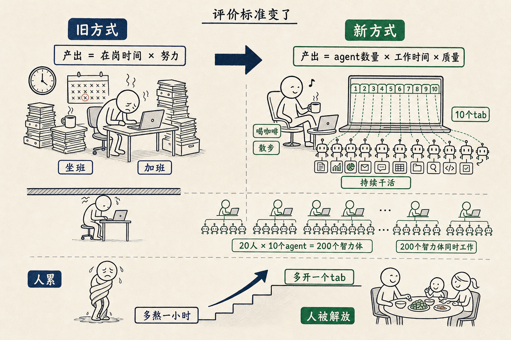

# 我允许你喝咖啡，但我不允许你的 agent 空着

在我们公司，我允许你喝咖啡。但我不允许你的电脑里的 agent 是空着的。

以前我们对一个员工的评价，看的是「努力不努力」。这个人加班吗？周末来吗？工作时长够吗？这个人坐在工位上吗？

这是工业时代的评价方式。因为工业时代，人的产出 = 人在岗的时间 × 单位时间内的努力。

现在变了。

现在一个员工的产出 = 他指挥的 agent 数量 × agent 工作时间 × agent 工作质量。

请注意——他自己的时间，已经不出现在这个公式里了。

他自己在干什么？喝咖啡也好，开会也好，散步也好——都行。重要的是他指挥的那些 agent 此刻在不在干活。

直播那天我说，我们公司很快会进入这样一个状态：

20 个员工，每个员工 10 个 agent，整个公司同时有 200 个智力体在干活。这 200 个智力体一刻不停。

员工本人呢？

可能在喝咖啡，可能在跟客户散步，可能在午睡。我不在乎。我在乎的是——你电脑里的 10 个 agent 此刻是不是在做有意义的事。

如果是，你可以去玩。
如果不是，你就算 996 也没用。

这句话听起来像段子，但我真的越来越认真。

你想，**一个再努力的人，他一天能干多少活？**

打字 10 个小时，写 5000 字。开会 10 个小时，做 3 个决策。坐在工位上努力 16 个小时，干的活是 16 个小时的活。再多就累死了。

而**一个会指挥 agent 的人**，他自己什么都不用做。他只要在睡觉之前，把 10 个大活想清楚，分别开 10 个 tab，把每个 tab 的需求讲明白，然后他去睡觉。

第二天早上起来，10 个大活全都做完了。

这两种工作方式，效率差 10 倍。

更可怕的是——后一种方式，员工是有精力的、是不疲倦的、是有时间陪孩子吃饭的。

前一种方式，员工是被拧干的、累的、心情不好的、晚上回家跟家人吵架的。

「我允许你喝咖啡，但我不允许你的 agent 空着」——这句话听起来像是要求，其实是解放。

它在说：我不再用你的肉体时间换产出。你的肉体时间是你的，去喝咖啡、去散步、去陪你的孩子。

但你必须有调度 agent 的能力。这一点没有商量。

你不会调度 agent，那你就得回到老的方式——用你自己的时间换钱。那种方式的天花板，你早就摸到了，对吧？

学会调度 agent 之后，天花板才刚开始升起来。

升到哪里？我自己也不知道。

但我知道一件事——那个天花板不在「你能不能多熬一个小时」这条线上。

它在「你能不能多开一个 tab」这条线上。

你昨晚睡觉之前，开了几个 tab？
