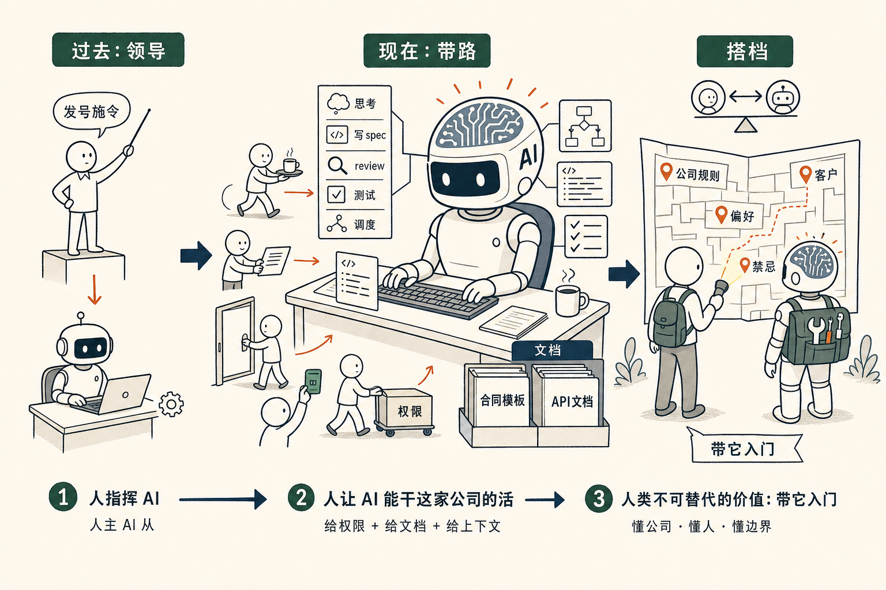

# 我们从 AI 的领导，变成了 AI 的带路党

我们以前是 AI 的领导，现在我们是它的带路党——说得难听点，是它的维修工、端茶送水的。

听起来像自嘲，其实我是认真的。

最近两年我们一直在讨论一个问题：人和 AI 谁是主、谁是从？

主流的说法是，人当然是主。AI 是工具，是助手，是仆人。我们「使用」它，「驱使」它，「让」它干活。

但这一两个月，我自己的体感慢慢翻转了。

我现在用 Claude Code 干活。我经常坐在那里干嘛？等它。它一个任务跑一两个小时是常事。我开 10 个 tab 是因为不开就只能傻等。

它在思考、在分析、在写 spec、在 review、在调度 sub-agent、在跑测试。它每一步都在做真正意义上的智力工作。

而我在干嘛？我在端茶送水。

它说「我需要这个文件」——我去找。
它说「我需要这个权限」——我去开。
它说「这个 API 我不熟，给我个文档」——我去贴。
它说「我需要看一下你们公司的合同模板」——我把那 400G 的 Folder 给它。

我们不再是「领导 AI 的人」。我们是「**带 AI 进入这个公司的人**」。

公司的门朝哪边开，公司的董事会在哪儿，公司的财务规则是怎么写的，公司的客户是哪些，公司的禁忌是什么——这些 AI 自己进不来。

它需要一个带路党。

带路党就是我们。

我们的工作内容，从「干活」变成了「**让 AI 能干这家公司的活**」。

这件事一开始让我有点失落。

我接受过的教育是——人是主体，工具是客体。机器再厉害，也是被人用的。

但我现在每天看着 Claude Code 在干活，我得诚实地承认：**它的智力，已经在很多具体问题上超过我了。**

不是所有问题。但在「把一段中文需求翻译成精确代码」「把一份文档整理成五种格式」「把一个 idea 用 YC 的方式拆解」这些事情上——它比我快、比我准、也比我不知疲倦。

我承认了这件事之后，反而放松了。

我不再假装是它的领导。我接受我是它的带路党。

带路党也有带路党的价值。

它需要我，因为这个世界它没进来过。它不知道我们公司，它不知道我的朋友，它不知道我的偏好，它不知道我们这家公司从哪天开始做了什么、为什么这次又决定换方向。

我把这些一点点告诉它。

它做出来的东西，比它自己单独做的好 100 倍。
我做出来的东西，比我自己单独做的好 100 倍。

我们成了一对很奇怪的搭档。
不是上下级，不是主从，不是甲乙方。
是带路党和大神。

带路党不需要比大神聪明。带路党需要的是——我知道这个公司的所有角落，我知道大神缺哪一块时该去哪里找。

这事儿真的没什么好失落的。

人类几千年第一次拥有了一个比我们聪明的搭档——不是上司，不是奴隶，不是孩子，是搭档。

我们小小的、但是不可替代的工作，是带它入门。

<section style="background:#f7f5f0;padding:20px 22px;border-radius:8px;margin-top:32px;">
<strong style="color:#777;">上篇精选留言 ·《<a href="https://mp.weixin.qq.com/s/L8puybdd9rr_OI3iSnS-dw" style="color:#888;text-decoration:underline;">吃一堑长一智.skill —— 那一秒，是改大脑参数最好的时机</a>》</strong>

上一篇说：犯错懊恼的那一秒，正是改写自己大脑「参数」最好的时机。

3 条留言里，最值得分享的 3 条——

<strong style="color:#777;">JunChenོ ²⁰²⁶（浙江 · 👍 3）</strong>

我们不知道大模型为何会智能涌现，正如我们也不知道人类为何会产生智慧

<strong style="color:#777;">西瓜珍宝（上海）</strong>

把自己当 AI，主动构建环境，将自己数据化赛博化

<strong style="color:#777;">普通AI星球（上海）</strong>

烦恼即菩提，bug 即优化。

「把自己当 AI、给自己构建环境」这条留言，其实和今天这篇说的是同一件事。谢谢每一位留言的朋友。
</section>
