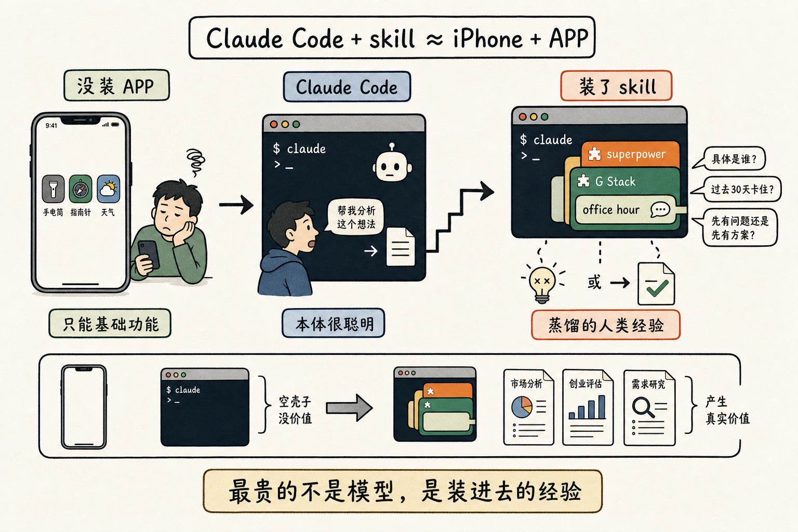

# 不装 skill 的 Claude Code，就是没装 APP 的 iPhone

不装 skill 的 Claude Code，就是没装任何 APP 的 iPhone。

一个 iPhone 没装 APP，你能干嘛？打开它，里面有个手电筒，有个指南针，还有一个天气预报。你天天打开就看天气预报，开开就看天气预报。

它当然也算手机，也能打电话。但它没有你的世界——没有微信，没有地图，没有银行，没有打车，没有外卖。剩一个壳子。

Claude Code 也是一样。

它本身是一个非常聪明的命令行——这个聪明已经够吓人了。但你直接打开它，跟它说「帮我做这个」，它会做。会做得也凑合。

但你想干一件正经事呢？想让它做一份真正的市场分析，想让它评估一个 startup 的 idea，想让它去研究一个产品到底有没有需求？光靠它本身那一层智力是不够的。

这时候你需要一个 skill。

我自己一直在用两个：

一个叫 superpower，是 Jesse 写的。一个叫 G Stack，是 Gary Tan 写的——就是 YCombinator 现在的那个 President，前任是 Sam Altman。

G Stack 里面有一个组件叫 office hour，它把 YC 那些 program partner 跟创业者聊天的方式，一句一句地蒸馏成了几千字的 prompt。我跟它聊一个 idea，它就用 YC 的那套质问方式来逼我：

你有没有一个具体的人，过去 30 天里因为这事卡死了？
你的答案里有没有一个具体名字？
你是先有问题去找方案，还是先有方案去找问题？

它会一直问一直问，直到这个 idea 经不起问，或者经得起问。我那天讲的那个「雇真人 AI 市场」的主意，就是这么被问死的。

我问它的时候，我用的是 Claude，对吗？

是，但又不完全是。

我用的是 Claude 里面装的 G Stack 里面的 office hour。剥掉任何一层，它就不再是同一件事了。

所以你看到一个工程师不写代码、对着 Claude Code 一通操作，做出来一份比你公司市场部还专业的方案——你别羡慕他智力高。他只是装了几个你没装的 APP。

最贵的不是 Claude Code，最贵的是装在 Claude Code 里面的那些被蒸馏过的、几千几千字的人类经验。

我前几天才意识到这件事，回过头看 iPhone 2008 年到 2010 年那两年——大家也是一样，先去试各种各样的 APP，切西瓜啊，愤怒的小鸟啊。试着试着，自己的手机就跟别人不一样了。

现在的 Claude Code、Codex，就是 2008 年的那个 iPhone。

外面已经有上万个 skill 了，每天还在出。营销号天天给你推。你别都信，但你也别一个都不试。挑几个看着像那么回事的装上，用一用，然后你的 Claude 才开始变成你的 Claude。

不装的话，它就只是个手电筒。
