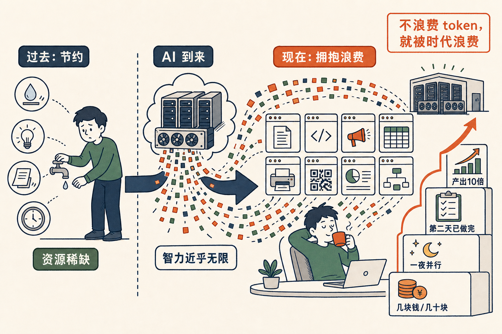

# 拥抱浪费——你在喝咖啡，GPU 替你烧 token

5 月 7 号那场直播，我屏幕上同时开着 20 多个 Claude Code 窗口，每一个都在哗哗哗地跑。我电脑的 CPU 在烧。OpenAI 远处机房的 GPU 在烧。每秒钟都有大量的 token 在被消耗。它们都在为我干活。

而我在干嘛？

**我什么都没干。我在喝咖啡。**

这场直播的标题，我起的是「**拥抱 Token，拥抱浪费**」。这一句我想得很认真。

我们这一代人——尤其是我这种 70 后——成长在「节约」的世界里。

节约用水。节约用电。节约纸张。节约时间。
浪费可耻。
能多用一次的东西不要扔。能不点的灯不要点。能不开的空调不要开。

这些教育在过去 40 年是绝对正确的。因为过去 40 年，世界里**几乎所有的资源都是稀缺的**——水、电、油、粮食、人的时间。

但 AI 来了之后，发生了一件历史上从没发生过的事——

**有一种资源，它突然变得几乎无限。**

这种资源叫智力。

更准确地说，叫 token——大语言模型一个字一个字往外吐的那个 token。

一个 token 一两百 micro-cent。OpenAI 的 GPU 一台一万小时。你晚上睡觉的时候，一个 agent 跑一个晚上，最多花你几块钱、几十块钱。

而这几块钱、几十块钱，换回来的是——

**一份 5000 字的产品 spec。**
**一份 17 项任务的市场计划。**
一个把你公司所有报销单按月分类的 Excel。
一个学会自己写二维码识别程序、自己安装公司打印机的 47 分钟的 agent。

如果你还用节约的心态看这件事，你就会本能地说——

「这一次让 Claude 跑两个小时，会不会浪费钱？」
「我只让它写代码就好，让它写 spec 是不是绕远了？」
「我先想清楚再让它跑吧，不然万一不对，token 不就白花了。」

每一句听起来都很有道理。

每一句都在让你错过这个时代。

这个时代的逻辑是反的——你不浪费 token，你就被时代浪费。

我自己现在用 Claude，是怎么用的？

我经常一晚上开 10 个 tab，每个 tab 都让它跑一个大活——评估 idea、写 spec、做 marketing、改 APP、整理报销、装打印机、做语言学习、写公众号草稿。

我不在乎每个 tab 它到底要跑多久。我不在乎它中间走没走弯路。我不在乎它写 spec 的时候花了多少 token。

我在乎的是——等我第二天早上起来的时候，有多少件事已经做完了。

代价是几块钱。几十块钱。最多上百块钱。

但换回来的，是我一个人的产出，相当于过去的我的 10 倍。这是这一两年我自己赚到的最贵的东西。

所以——

节约 token 是 1950 年的美德。
浪费 token 是 2026 年的美德。

你今天有没有浪费一些 token？
没浪费的话，今天 GPU 替你烧得不够多，你的产出也不够多。
