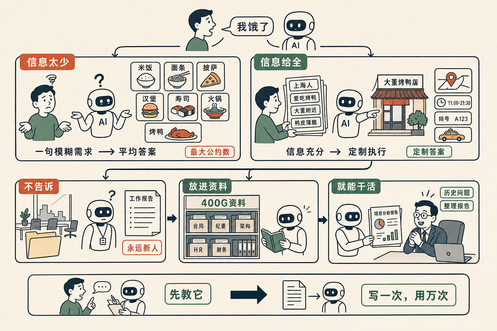

# 你说一句「我饿了」，AI 怎么知道你想吃烤鸭

最近一个多月，我见到太多人跟我抱怨——

「AI 真没法用。」
「试过了，输出的东西完全用不上。」
「就是在瞎搞，你们说的都是吹的。」

我每次听到都问一句：你怎么试的？

答案几乎一模一样——**「我打开豆包，问了一句话，看了看回答。」**

我说，要这都能用，那才真是见了鬼了。

我打个比方——

你跟一个人说一句「我饿了」，他能猜出来你想吃烤鸭吗？

不能。除非这个人已经认识你 20 年，知道你只爱吃烤鸭，连大董分店在哪都背下来了——他才能猜出来。

但一个新来的 AI，对你一无所知。

你说「我饿了」，它最多猜到「这个人现在缺食物」。它会给你一个食物清单：米饭、面条、披萨、汉堡、烤鸭、寿司、火锅……

你看到这个清单，骂一句「废物」，关掉。然后你跟周围的人说：AI 没法用。

这件事不是 AI 没法用，是你没有告诉它「烤鸭」。

如果你换一种用法——

你告诉它：「我是个上海人，但我爱吃烤鸭。我家附近大董有一家分店。我对鸭皮要薄、要脆有特别要求。今天我嘴里又馋了——你看我饿了，建议我去哪里？」

它会立刻给你大董的具体门店、营业时间、要排几号、要不要订位、它替你顺手打车叫上。

同样一个 AI。同样一个问题。

只是你把它当成了一个真正的执行者——给了它必要的信息。

这件事对一个人来说叫「告诉它」。对一家公司来说，叫「**告诉它公司是怎么运转的**」。

我们公司用一个 Folder 装了 400G 的东西——历史合同、董事会纪要、组织架构图、HR 制度、财务规则。

我随便问 AI 一个董事会历史上的事，它整理出来一份报告，让我大吃一惊。

但你想——如果我没把这 400G 的东西放进 Folder，AI 怎么可能整理出这份报告？整理出来反而叫「泄密」。

所以**你不要再说「AI 不行」**。先问你自己一个问题：

我有没有告诉它，它要回答的这件事的全部背景？
我有没有告诉它，我的偏好、我的禁忌、我的历史？
我有没有把所有相关的文件，都扔到一个它能读的地方？

如果三个答案都是「没有」，那它当然给不出好答案。

它给的就是「米饭面条披萨汉堡」的最大公约数。是这个世界对一个陌生提问者的平均答复。

你要的是定制答案。那你就得先给它定制信息。

这其实就是「跟一个人共事」的最基本规律——

新人来了，你要花一个月教他。
老员工来了，他做事顺，是因为他知道公司怎么运转。
AI 来了，你不教它，它就是个永远的新人。

你愿意给同事讲 10 遍，
为什么不愿意把这 10 遍写成一份 1000 字的文档丢给 AI？

写一次，用一万次。
