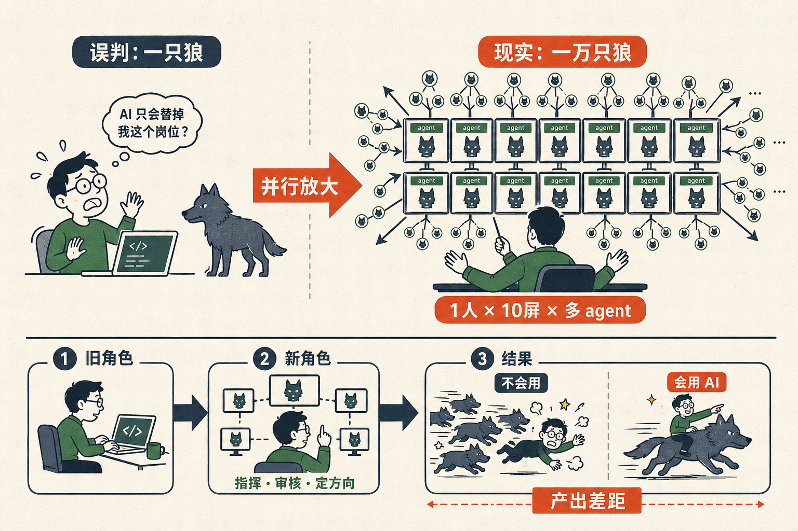

# 大家说狼来了，其实是一万只狼来了

最近经常听到一种说法——

「以后不需要工程师了。」
「AI 把白领都干掉了。」
「失业潮要来了。」

你们以为的狼来了，是一只狼。真实的情况，是一万只狼来了。

直播那天我演示给大家看：我在 Claude Code 里同时开 10 个窗口。第一个窗口我让它评估一个 idea；第二个窗口我让它给一个 APP 加一个 brainstorming 功能；第三个窗口我让它做 marketing；第四个窗口我让它给 Caser 这个 APP 写一个新的页面；然后是第五、第六、第七、第八……

每个窗口里它都开始干活。每个窗口里它又调用 5 个 sub-agent，每个 sub-agent 在并行干活。

我数了一下，光是我一个人，那个晚上同时跑了大概二三十个 agent。

它们没在跑死循环，没在浪费。它们在做智力工作。而且每一个的智力水平，**至少不低于在场的我**。

你想想这个画面——

如果我们公司 20 个人，每个人开 10 个 agent，整个公司就有 200 个智力体在干活。这 200 个智力体在我们去食堂吃饭的时候、去喝咖啡的时候、去开会的时候、晚上睡觉的时候——一刻不停。

这不是一只狼。

这是一万只狼。

而且这一万只狼，每一只都有研究生级别的智力。

**「以后不需要工程师」**这句话之所以引起的恐慌不够大，是因为大家脑补的画面是错的。

脑补的画面是：原来的工程师变得没必要，公司省了一笔工资。

真实的画面是：原来的工程师全都坐到办公桌后面，每人面前 10 个屏幕，每个屏幕上一个 agent 在帮他干活，而他的工作变成了——指挥、审核、决定、写规范、调整方向。

工程师没有消失。工程师变成了一个调度 10 个 agent 的指挥官。

但凡你不是这样工作的，你就是被这一万只狼撞翻的那一个。

不是 AI 把人吃掉了。是会用 AI 的人，把不会用 AI 的人吃掉了。

而中间的差距，不是工资差距、不是职位差距——是**单位时间内你能产出的智力工作量**的差距。

一个会指挥 10 个 agent 的人，产出是不会的人的 10 倍。
一个会指挥 100 个 agent 的人，产出是不会的人的 100 倍。

而且这件事开始得很快。

我自己的体感——快到我每周都要重新评估一次自己的工作方式。上周以为已经够快了，这周看就慢了。

所以听到「狼来了」的时候，不要再脑补一只狼。

脑补一万只。然后开始决定——你要做被狼吃的那个，还是骑狼的那个。

骑狼的方法不复杂：先去试一下骑。

骑过之后你会发现，狼其实很听话。它只是没人骑过它而已。
