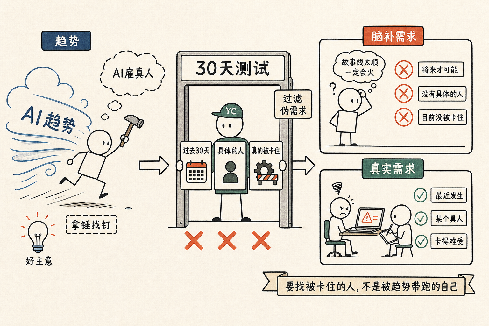

# 趋势不等于需求：你的 90% 的好主意，都过不了这一关

直播那天，我被一个 AI 当场毙掉了一个 idea。

我演示的是 Claude Code 加 G Stack 的 office hour 这个 skill。我跟它讲了一个主意：

「我想做一个 AI agent 的市场。AI 在干活的过程中会遇到很多它干不了的事，那它就发布一个悬赏，让一个真人去干，比如订一杯咖啡、提交一份表格。怎么样？」

它没说好。它问了我一个问题：

「你能不能告诉我，过去 30 天里，你身边有一个具体的人、因为某件事被 AI 卡死了，是真人才能干的？」

我想了一会儿。

没有。

它继续追问：「你的回答里有没有名字？有没有具体的开发者？有没有具体的团队？」

没有。我老实承认。

它说：你的回答是教科书级别的红旗。这是 Solution in search of problem。你是先看到 AI agent 这股风来了，再回过头找一个问题往里套——这是拿着锤子找钉子。趋势不等于需求。

那一刻我有点不好意思，但又松了一口气。因为我以前 90% 的好主意，其实都是这么死的。

只是我以前没有一个会顶我的人，一个会问我「过去 30 天有没有具体的人」的人。

YC 这帮人为什么这么厉害？我以前看不出来。

现在我懂了一点：他们这一套问题，是过滤创业者用的。

他们见的人多，每天面对几百个 idea。如果他们听完每个 idea 都自己去验证，会累死。所以他们发明了一套问题，把伪需求过滤掉：

「过去 30 天里，有没有具体的人，被这个问题真的卡住？」

这一个问题就够了。

「过去 30 天」——挡住了「将来某天可能会怎么样」的虚空想象。
「具体的人」——挡住了「很多人都觉得」的群体抽象。
「被卡住」——挡住了「nice to have」的伪痛点。

这一关过不了，后面所有的故事都是脑补。

我自己做的 AI 雇真人的主意，三个都过不了：将来才可能、没有具体的人、目前没被卡住。

但是——

我直播完之后，越想越觉得这一关其实人人都该用。

不光是创业。你想换个工作？过去 30 天里有没有具体的事让你真的觉得现在的工作无法忍？你想买一个新工具？过去 30 天里有没有具体的事让你觉得现在的工具不够用？你想推一个新功能？过去 30 天里有没有一个具体的用户来找你抱怨过这件事？

这一关过不了，多半就是你脑补了一个需求，然后给自己讲了一个故事。

故事讲得太顺了，连自己都信了。

直到 office hour 这个 AI 像 YC 的合伙人一样，平静地问了你一句——「过去 30 天里，有没有具体的人？」

我们要的是被卡住的人，不是被趋势带跑的我们自己。
