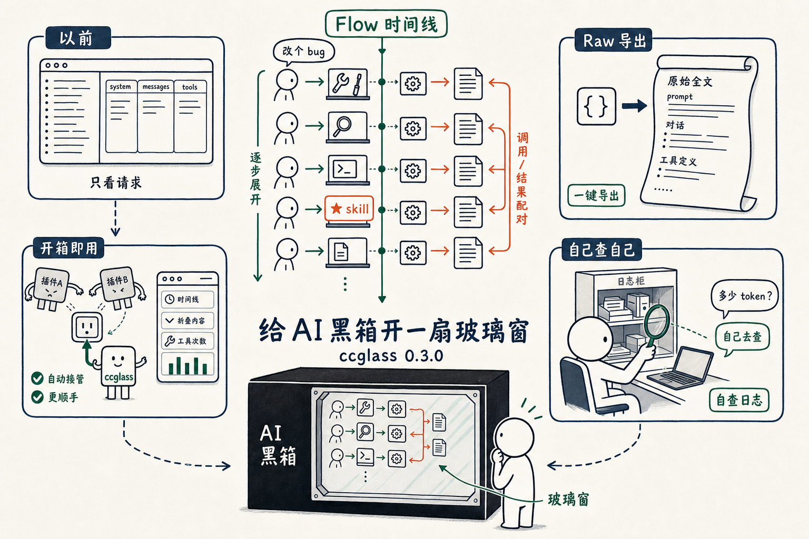

# ccglass 0.3.0 新功能发布

上周我写了个 ccglass，能看到 Claude Code 在背地里跟大模型说了什么。那时候它还只是个看请求的小工具——左边一列请求，右边几个标签页，system、messages、tools 摊开给你看。

这周它长了不少。今天发了 0.3.0，说几个我自己最想要的新东西。

最大的一个，是 **flow**。

以前那一列请求是干巴巴的，你知道 agent 发了五十次，但不知道这五十次之间发生了什么。现在点开 flow，是一条从上往下的时间线：模型先从几十个工具里挑了哪个、这个工具在你本地怎么跑的、跑出来的结果又怎么喂回给模型、模型接着再挑下一个。一来一回。

配对的「调用」和「结果」用同一个颜色连起来，skill 调用也单独标出来。

一句「改个 bug」，点开就是五十多步工具调用。**每一步它先做什么、再做什么、结果是什么，全摊在那儿，清清楚楚。**

第二个是 raw 导出。我不想看给机器读的 JSON，我想看人能读的：模型到底收到了什么 prompt，缩进、换行、一字不差。现在一键导出一份干净的请求全文，系统提示词、对话、工具定义，全在那儿。

第三个有点绕，但我很喜欢：agent 现在能查自己。我把 ccglass 的查询能力做成工具塞进了 Claude Code，于是你可以直接在对话里问它「我刚才那条请求花了多少 token」，它自己去翻日志回答你。**自己看自己。**

还有些小的：左边每条请求标了时间、标了用过几次工具，长内容能折叠起来，启动自动开浏览器。

最后修了个 bug。有朋友用 cc-switch 切换供应商，结果面板里一条请求都抓不到——它跟 ccglass 抢同一个地址，ccglass 抢输了。现在 ccglass 会自己认出来、自己接管，开箱即用。

写代码的 agent 越来越聪明，也越来越像黑箱。我做 ccglass，就是想给这个黑箱开一扇玻璃窗。**现在这扇窗，能看见它每一步是怎么动的了。**

装和升级，就这一行：

<section style="background:#f6f8fa;border-radius:6px;padding:14px 16px;overflow-x:auto;font-family:Menlo,Consolas,monospace;font-size:14px;line-height:1.8;color:#24292e;">npm install -g ccglass</section>

代码全部开源在 github.com/jianshuo/ccglass，上线一天多就有快一百颗 star 了，挺意外的，喜欢的话帮我点一颗。
