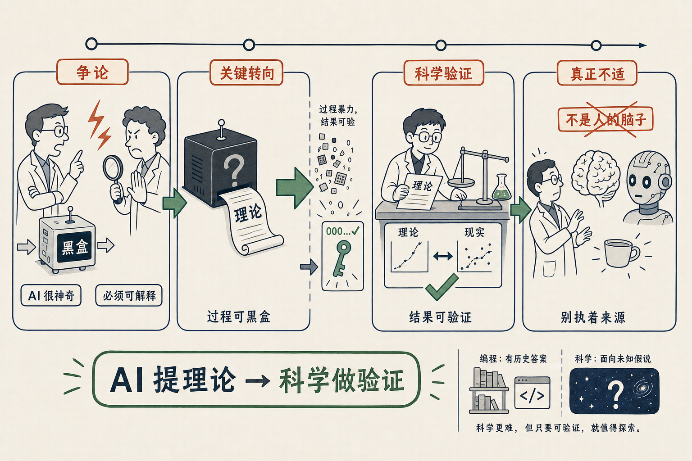

# AI for Science：你不需要解剖爱因斯坦怎么想出相对论

大概两年前，在一个学校的嘉宾休息室里，我亲眼看见两个科学家吵了起来。

一个是做视觉模型的，他兴奋地跟另一个科普：你知道吗，现在的人工智能可厉害了，我们输进去一个东西，它就出来一个东西，中间怎么 work 的我们不知道，他说，非常神奇。

另一个是做生物化学的，当场就反对。他说，这不是科学。什么叫科学？科学是我必须清晰地知道它每一步的推演逻辑，并且可复验。所有的研究都要公开实验、论证可复制，才能说你发现了一个规律。中间要是个**黑盒子**，我怎么知道这个事情是怎么发生的？他极其抗拒，觉得这不合理。

有意思的是，这场争论过了大概三个月，铺天盖地都在谈 AI for Science 了——只要有足够多的算力，我们就能把那些还没被发现的、世界运行的规律给找出来。

我当时在旁边看，觉得极其有趣。一边是 AI 在初探里感觉没有边界；另一边是传统科学家极其抗拒，因为好像有什么东西撼动了他们的信仰。在他们看来，AI for Science 就是在搞幻觉，不可验证。

但我自己的判断是：这俩并不冲突。

关键看你怎么定义 AI for Science。现在大家的定义其实都不一样，连描述的东西都不一样。在我看来，它只要能推出来一套理论就行——这套理论，照样用传统科学的方式去验证它是不是 work。

打个比方，就像区块链上算那个 Nounce 值。
算的过程可以非常暴力，
但最后它啪一下算出来一个数，
你去验证这个数的哈希值前面是不是有那么多个零。
算的过程怎样不重要，结果是科学可以验证的。

科学也是一样。你也没有办法去验证爱因斯坦当年到底是怎么想出相对论的。可这不重要。**重要的是相对论这个理论，拿去跟现实对一对，匹配不匹配**。

那机器，其实就是一个爱因斯坦。

它的思考过程，不需要解剖出来让你知道。它会产出一个理论、一个结果，然后所有的科学家，用现有的这一切方法去验证就好了。

顺着这个角度往下想，传统科学家真正在抵抗的，其实不是"不可验证"——验证的方法一直都在，没变过。他们抵抗的，是**那个脑子不是人的脑子**。

可是，如果有一个外星人，或者一个 AI，能告诉我们一些像相对论一样、对人有帮助的东西，能让一个杯子悬浮在空中，这多好啊。我们为什么一定要执着于"这个东西必须由人类自己想出来"呢？

我得老实说一句，Science 不是我擅长的领域，平时也没怎么紧盯。对于写代码这种事，AI 容易，因为历史上有海量代码库告诉它正确答案，无非是把重复过上万遍的事再重复一遍。而 Science 是要在未来的一千种假说里找出那一种 work 的，没有任何历史资料可依。这两件事，难度不在一个量级上。所以这只是我站在旁边看到的一点想法，你完全可以纠正我。

