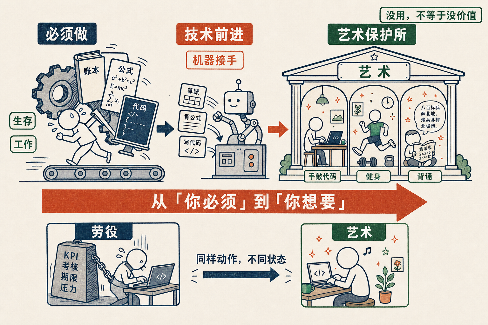

# 落后生产力的保护所，就叫艺术

有人问我，科技再怎么发展，人总还会留下一些被称为艺术的东西吧？我同意。但我想先把「艺术」这两个字定义清楚。

在我看起来，**所有落后生产力的保护所，就叫艺术**。

任何一件事，当它的技术足够落后，它就可以被称为艺术。

我这么说，不是贬低艺术。恰恰相反，艺术在人类这里有一个非常重要的位置，这个位置就是——它不是为了某个实用目的才做的东西。你保护它的原因，仅仅是因为你想保护它。不为了有用，甚至也不一定为了美，就是想留着。

举个具体的例子。我可以很有把握地说，再过 10 年，手写 Python 这件事，就是一门艺术。它可以进展览馆，可以当作非物质文化遗产，一代一代往下传很多年。到那时候你坐在那儿一行一行手敲代码，跟今天有人坐在那儿手工拓碑、手工雕版，是一回事。

那我们还要不要做这些「没用」的事？要的。

就拿健身打比方。健身是世俗意义上最没有意义的一件事——
你得掏着钱，
去让自己那么累，
事后又毫无 return。
你做它，仅仅是因为你想跑步，想动一动。

背书也一样。绕口令也一样。你让小孩子背一段绕口令，绕口令对他将来的工作到底有什么用？九九乘法表呢？以后机器张口就算，背它做什么？这些东西会越来越变得「无用」。但它们不会消失，它们会变成**纯粹的自娱自乐**——人为了让自己愉悦、为了锻炼自己的脑子而做的练习。不依赖它来工作，也不依赖它来活下去，就是想做。

我知道这话在物质匮乏的世界里是无法想象的。就像那个老笑话——等我有钱了，我要买八个馍，吃一个扔一个。在一个东西不够用的年代，「做没用的事」听上去近乎荒唐。可一旦东西足够了，这个逻辑就翻过来了。

而我真正想说的，是后面这半句。

当这种「艺术」的领域越来越广，越来越多原本「必须做」的事变成了「可以不做」的事——人的生活其实很好啊，你不觉得吗？

过去你写代码、背公式、算账，是因为不得不。是生存按着你的头，逼你去做。现在机器把这些「不得不」一件一件接过去了，留给你的是另一种东西：

你不是必须做这件事，而是**你选择做这件事**。

这两个状态，差着一整个人的自由。

被迫去做一件事，和因为喜欢而去做同一件事，动作可能一模一样，里头的人却完全不同。前者是劳役，后者是艺术。技术每往前一步，就把一批活儿从前一格挪到后一格——从「你必须」挪到「你想要」。

所以我一点都不为那些正在「过时」的本事难过。它们没有死，它们只是从生产力退役，搬进了艺术这间保护所，从此安安静静地，被人仅仅因为喜欢而留着。

