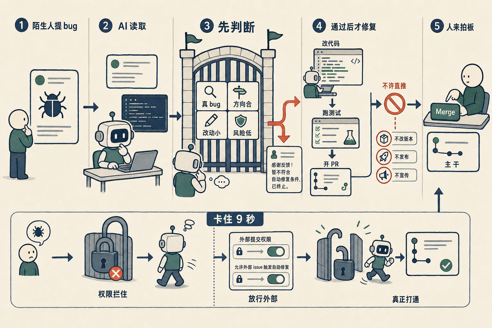

# 有人给我提了个 bug，我一行没改，AI 自己提了 PR

今天发生一件小事。

我有个开源的小工具叫 ccglass，是给 AI 编程 agent 做的一个日志面板——agent 在背后跟大模型说了什么、报了什么错，它都实时显示出来。东西不大，几个文件。

有个我不认识的人，在 GitHub 上给它提了个 bug：在 Windows 上跑 OpenCode，启动就报错。

放在以前，这种 issue 我得自己读、自己复现、自己改、自己测、自己提交。今天我什么都没做。是 AI 读了这个 issue，判断了一下值不值得修，然后自己改了代码、跑了测试、开了一个 PR 等我合并。我要做的，只剩点一下「Merge」。

听上去像「AI 会写代码」这种老话。但真正让我觉得这事能托管出去的，不是它会改，而是中间那一步——

它会先判断。

我给它的指令里，第一步不是「去修」，而是「先 triage」：这是个真 bug 吗？这个需求跟项目方向合不合？能不能小改一处搞定、还是要动架构？改了会不会带出新问题？只要有一条不过关，它就**不许写代码**，只在 issue 下面留一句礼貌的评论，说清楚为什么不做、或者要我补什么信息，然后停。过了这四关，才允许动手。

这一步特别关键。让一个 agent 写代码不难，难的是**让它知道什么时候别写**。一个埋头乱改的 agent，比一个什么都不会的还危险——它会把你的小工具改成一个四不像。先判断、再动手，这套顺序，才是把「会改代码」变成「能放心交给它」的那道闸。

我还给它画了几条死线：永远不许直接推到主干，不许改版本号，不许发布。它只能开 PR，合不合、发不发，是我点头。机器干脏活累活，最后那个决定留在人手里。

但理想和现实之间，今天正好露了个缝。

我本以为这套早跑通了。结果就是这个陌生人提的 issue，AI 一动不动，9 秒就退出了。查下去——是权限。这个流程会先看「提 issue 的这个人有没有写权限」，外部用户只有读权限，于是它判定「这人没资格让我干活」，直接收工。等于说，**只有我自己提的 issue 它才修，别人提的它一概不理**——这恰恰跟我想要的反过来了。

加一行配置，把外部用户也放行，才算真正打通。

我喜欢这种小事。它把一个抽象的承诺——「让 AI 自己维护项目」——具体到了一条 9 秒就失败的日志、一行权限配置上。理想很好讲，缝都是藏在这种地方的。

现在它真能修陌生人提的 bug 了。我盯着那个 PR，有点恍惚：我好像不再是这个项目唯一的程序员了。

