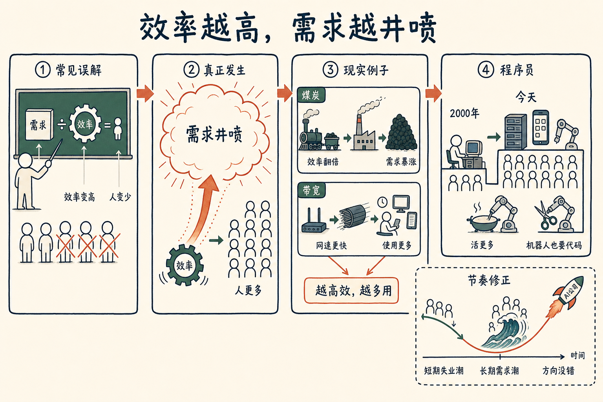

# 效率越高，需求越井喷

有人问我，大模型每迭代一次，是不是就把一批程序员、一批应用公司给淘汰掉了。一个程序员现在的效率比三个月前高了十倍，那是不是公司只要留五个人、剩下的都该失业？

这个算法，是我在很多很多次革命里都见过的、人类最大的一个误解。

误解就藏在一道简单的除法里：**需求量不变，除以变高的效率**，得到一个更小的值。三十个人干一年的活，现在一个人一周干完，那就只要一个人了——剩下的二十九个人去哪？这道除法看上去天衣无缝，所以大家就开始算裁员、算失业。

但没有人去想，分子根本不是个固定的数。

举个例子。英国工业革命的时候，假设一年产一百万吨煤。瓦特的蒸汽机和一系列改良，让用煤的效率翻了一倍。所有人都预测：做同样的事，煤的需求会减到一半。结果呢？

**煤的需求涨了十几倍。**

带宽也是一样。网速变快，按理说我做同样的事，上网时间应该变短。结果上网时间反而越来越长。你会发现，每次效率一变高，按简单除法本该减半、甚至减到十分之一的钱和时间，实际上花得比以前更多。

为什么？因为效率提高一倍，需求往往不止提高一倍，而是五六倍、十倍。分母在变小，分子在以更快的速度变大，除出来的那个数，比原来更大。也就是说，**需要的人更多，不是更少。**

程序员就是活生生的例子。

按那道除法的逻辑：过去二十年，程序员的效率至少每年翻倍。2000年全国也就五十万程序员。一个今天的程序员，应该能把2000年所有的活都干了。那程序员的总数应该从五十万降到个位数——五个人就够了。

可实际上，今天全国的程序员是八百万到一千万。

原因很简单：2000年那点活的总量，今天看起来小得可怜。现在已经没有什么事不让程序员干了。有了具身机器人，连炒菜、理发这种跟代码八竿子打不着的事，都开始要程序员去做。这些活，二十年前根本没人提，因为那时候提了也没用——你没法想象一个软件公司列一张要做一百年才能做完的功能清单。需求被效率压着，根本没冒出来。

所以我一直说一句话：**被 AI 冲击的行业，才是该冲进去的行业。** 凡是 AI 影响不到的行业，反倒没什么前途。井喷往往就发生在被冲击最狠的地方。

话说回来，我得诚实地修正一下自己。我每隔一年都会问一次：过去这一年，我哪个论断错了？

如果让我现在改去年对 AI 的判断，我会说——
我高估了需求爆发的速度，
低估了失业潮的强度。

需求的井喷一定会来，满世界都在朝这个方向走，我相信一两年里就看得到。但26年、27年这两年，失业潮会比我想象的快，需求潮会比我想象的慢，中间那道 gap，没那么快被填上。我一个朋友说他是 Meta 这一波裁员的幸存者，可第一波被裁的人去了一家 AI 公司，手里股票已经超过一千万美元。这找谁说理去。

方向我没看错，节奏我看错了。这两件事，可以同时都是真的。

