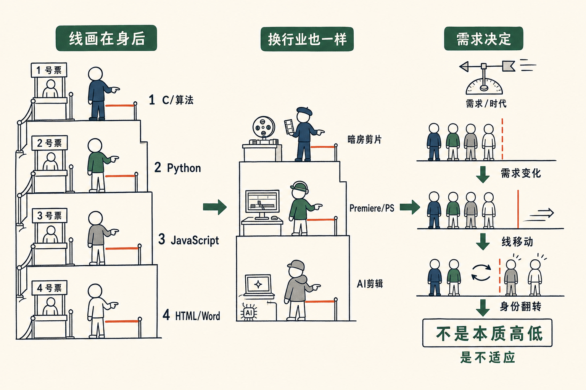

# 程序员的鄙视链

我跟很多人聊过一个问题：到底什么叫程序员？有意思的是，每个人对程序员的定义，都是把自己屁股后面那根线画下来——线以内是程序员，线以外不算。我把自己划进去，把比我「低」的那批人划出去。

这就形成了一条鄙视链。整个技术圈，几乎人人都默认有这么一条链。

## 人人都把线画在自己身后

这条链是一层一层往下排的：
会 C、会算法的看不起只会写 Python 的——你连冒泡排序都不会写，我奥赛的题都刷得很溜，你这种也叫程序员？
会 Python 的看不起写 JavaScript、写 node 的——那只能叫 script，只有 Python 才算程序员。
写 JavaScript 的看不起写 HTML 的——你只会写个网页，那是文秘，我得拿 React 这种前端框架写出来的才算。
写 HTML 的看不起拿 Word 做网页的——我好歹还写源代码，你拿 Word 算什么？

你看，整条链上，**每个人都把那根线画在自己身后**。线以内是程序员，线以外是外行，而那根线刚好就在自己脚底下。

## 就像排队买票

这特别像排队买票。凡是你站到了某一层，所有人都希望那道拦在自己后面。票卡在你之后，你之前都有票，你之后就没票了。前面的是自己人，后面的是外行。

道理人人都懂，可一旦自己站进了队伍，立刻就变成了护着那道栏杆的人。

程序员这件事，老实说就是一张纸。你去学 Python，真的很好学——它首先就是英文，结构稍微严格一点的英文而已，关键字就 20 个，除了这 20 个，其他全是你自己定义的。所以大家总是总是把程序员这件事给**神化**了。

## 剪视频也是一样

不只是程序员，任何一个行业都有鄙视链。

视频剪辑也是这样。用 AI 直接咔嚓一下就剪完的，被会用 Photoshop、Premiere、Final Cut 的瞧不起：你那也叫剪辑？我这才是专业的。可是在更老的电影人眼里，你连片子都不会拿到暗房里去剪、去弄，就在电脑上按几下，那压根不叫剪。

每一层都觉得自己脚下那根线，才是「专业」和「外行」的分界。换个行业，换批人，故事一模一样。

## 本质是不适应，不是有本质区别

那这条鄙视链，是不是就等于薪酬的排序？是不是越底层、越会 C 的，薪水就越贵，鄙视链就是这么来的？

不见得完全一一匹配。鄙视链是按「谁更底层、谁更难」排的，薪酬却不是。现在 C 程序员的薪水就没有 Python 程序员高，这仅仅是因为最近这段时间，跟 AI 相关、跟需求相关的代码，Python 会多一些；有的公司前端更重，那写 node、写 JavaScript 的就比写 Python 的更贵。反正都很难说，**都是当下的需求决定的**，并没有什么天生的高低。

所以说到底，鄙视链的本质是**不适应，而不是真有什么本质区别**。

你脚下那根线，并不是世界划的，是你自己划的。换一个时代，需求一变，线就挪了，挪到你前面去，你也就成了别人眼里的「文秘」「拿 Word 的」。

