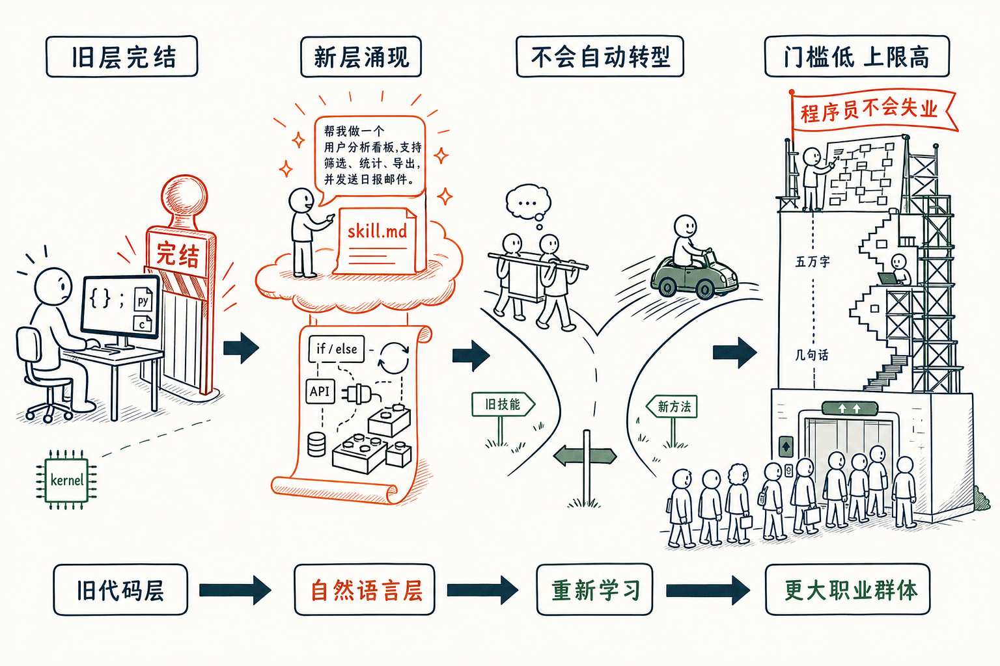

# 程序员「瞬间」失业了——但程序员永远不会失业

一个朋友前几天跟我聊天，很得意地说，他现在 80% 的代码已经是 AI 写的了。我很惊讶，问他你为什么还要写那 20%？你不应该写，一行都不应该写。

我问他，你会去改汇编语言吗？汇编语言本来就该由 C、Python 编译出来，由编译器去写，由 CPU 去执行。人站在汇编语言这一侧折腾干嘛呢？除非那是网络最底层的 kernel，否则一般的程序，你去碰它干嘛。

今天的 Python 和 C，在我看来已经到了人类可以撤出的时候了。

## 不是渐进的，是瞬间

很多人以为这是一个慢慢来的过程：今年 AI 写 80% 的代码，明年 90%，后年 95、99，最后还留 1% 由程序员用「古法编程」做出来。

不是这样子的。

当我看到 Claude Code 在各种程序里的表现，我不得不接受一个冰冷的事实：**用编程语言写代码这一层，已经完结了**。它不是一个渐进的过程，它是瞬间就完结了的，只不过整个社会要用很多年才意识到这件事。这是一个让我觉得挺凉的现实。

我说的程序员是有限定的——用 Python、C 这些编程语言去编程的这一层。这一层完结了。

## 但上面忽然多了一层

完结的同时，这层之上忽然冒出来一个全新的层。这一层是以前没有程序员意识到会存在的——**用自然语言编程**。

我现在天天在写程序，只不过不再写成什么点 py、什么点 c，而是 skill.md。以前编程要的那些东西——if、else、循环、从 library 里借现成的轮子、怎么调 API——一样没少，全要在最顶上那层自然语言里一五一十写出来。只是自然语言的效率，比原来的编程语言高太多了。这一层是忽然出现的，让大多数传统程序员措手不及。

## 抬轿子的人不天然会开车

我很替程序员担心。一个 Python 程序员，并不天然就会成为一个好的自然语言程序员。

抬轿子的人，并不天然就会开车。
他可以学，也许比一般人有一点点优势，比如认路；
但你不能说，会抬轿子就一定会开车。

反而是那些完全不会抬轿子的人——他什么旧技能都没有，只会开车，所以学得最快，开着车满世界跑。而骑马的、抬轿子的，因为手里有那身本事，遇到两条路总会选自己顺的那条，所以他们是最反对开车的一群人。

抓住这层涌现机会的，恰恰是那些完全不会传统编程的人，就是所谓的 vibe coding。程序员很不屑，可只有不会编程的人，意识到这件事对他有价值。

## 自然语言编程，一样要学

有人说，这些工具普通人也能用，不需要专业训练。这个判断是错的。

它一样需要专业的训练和学习，这是大家没意识到的。

会写一两句话，人是会贪得无厌的。只要三句话能搞定原来的事，他立刻就会去堆三万句，去搞一件全新的事。现在大家给 AI 的指令也就两三百字，未来应该都是五万字、十万字起——这就是新时代的程序，你得学会用框架和结构去写它。

学传统编程其实很简单。Python 拢共 20 个关键字，常用就 5 个，全是最简单的英文，普及一下两三个小时够了。难的是后面五年十年的积累。自然语言编程也一样：**门槛极低，上限极高**。

## 所以程序员永远不会失业

这是我的宏观判断：程序员这个工作，将会是未来收入最高、工作总数最多、上升空间最大的一个群体。只不过他们不见得再用现在的编程语言来编程。

为什么门槛会变得非常低？任何大规模产生的职业，下限都低。就像开车，就像坐电梯——把门槛降到只要是个人就行。我们某种意义上都是电梯操作员，可这跟早年那种要对准楼层、要出力气的电梯，已经不是一回事了。

被 AI 冲击的行业，才是应该冲进去的行业；凡是不被 AI 影响的行业，反倒没什么前途。

