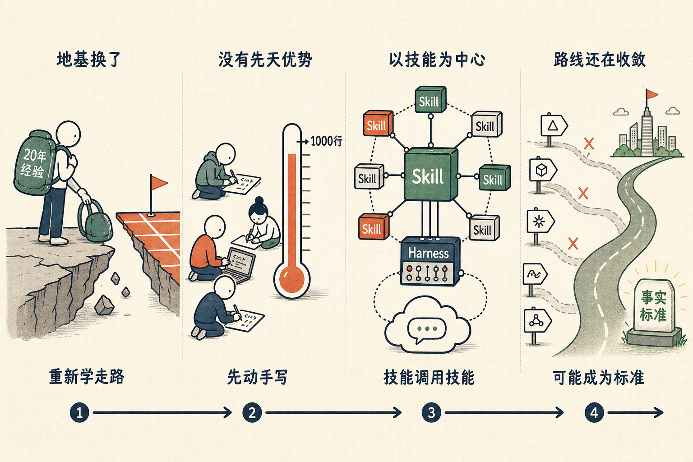

# 20 年前的程序员，重新学走路

我最近核心的状态，是在一个新的世界里，要重新学会走路。

当你脚下的整个层次变了，原来的程序员，不见得在这个新层次里还会写程序；原来的创业者，不见得在这里面还会创业。这不是谦虚，是一个挺朴素的事实——地基换了，会盖房子这件事得重新学。

前几天，我还在 X 上跟 Dash 聊天。他是心动、TapTap、VeryCD 创始人，我们 2000 年就认识，是二十多年的老朋友了。

他给我发来一句话，说：哎呦，我看了你的 GitHub 最近 commit 的时间，那个密度和强度，跟我最近很像啊。

我说，我们这种都是二十年前写程序的人，现在在 AI 里面，又重新开始学了。

不只是我们俩。最近这一段时间，尤其是上一波、上几波创业潮里的人，都在很努力地放低身段，认认真真地去写自己的第一个 skill，然后在这个新领域里发布一点东西出来。

一群曾经写过很多代码、做过很大事情的人，现在像新手一样，从第一个小东西开始写起。

我得说清楚一件事。这个过程里，**没有人有先天优势**。我不认为我，不认为 Dash，也不认为我周围任何一个老程序员，会比别人走得更快。

二十年的经验在这件事上不一定加分，有时候反而是包袱——你越熟悉旧的那一套，越容易拿旧的尺子去量新的东西。

但这群人确实还有一个优势，而且我希望更多的人都能有这个优势——**对新事物不抵抗**。一个新潮流来了，先别急着评判，全身心跳进去，自己动手写起来。

这一次，轮到我们这些二十年前写程序的人，又站回了起跑线，重新学走路。

