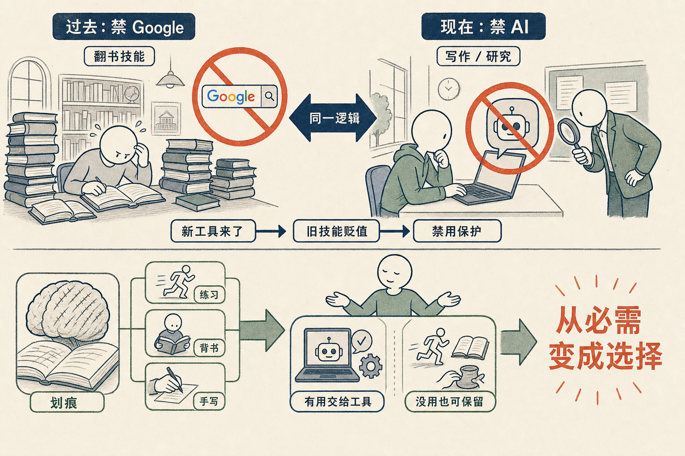

# 学校禁 AI，和当年大学禁 Google 一模一样

最近我看到一件事，越来越多的公司和学校，开始禁止学生用 AI。

老师坚持你不能用 AI 做任何研究，不能用它写论文。还有人专门去识别痕迹，找各种蛛丝马迹来对抗。微信这样的生态里，机器人生产的内容被屏蔽掉，人工智能生成的视频被删掉。平台想维持一个真实的人类生产、人类消费、人类沟通的世界——这本身我觉得没有错，这种真实感是生命力的源泉。

但我看到的是另一样东西，我管它叫**肉搏现象**。

一方面我们都知道这件事势不可挡，另一方面又有那么多人，在一个一个学校里，用各种笨办法去抵抗。这种肉搏，现在发生在很多很多行业里。

我翻了翻历史。

Google 刚出来的时候，很多大学也是禁 Google 的，不允许用，做研究必须翻书。

为什么必须翻书？因为当时的人认为，翻书是一项非常重要的技能。而 Google 把这项技能削弱了。所以你只能通过禁止这个新工具，来保护这项技能的价值。

现在回头看，其实挺傻的。**如果这个技能不重要，那就不重要了**。

我把学校禁的东西，归到同一个假设上：这个技能很重要，新工具一来，让它没价值了——所以在我锻炼这项技能的时候，你用新工具就是作弊，而且你永远没办法真正掌握它。

但我想反过来说一句：**如果这个技能不重要，那就让它不重要好了**。

## 关于「划痕」，我们有过一次分歧

汤维维不太同意我，她说她站在矛盾的中间。她转述了李继刚的一个说法，叫「划痕」——人脑的价值，在于有些事是你自己做过的：你努力背过这本书，努力理解过这段话，在脑子里留下了一些东西，那些东西就是划痕。你只有亲自去浏览、分析、理解一百本书，才能真正认识、记忆、再生产。用了 Google，你瞬间拿到那两句话，可那一百本书消失了。

李继刚说的这部分，我完全同意。

无论科技怎么发展，人都会保留一些东西，我把它叫做**艺术**。在我看起来，所有落后生产力的保护所，都被称为艺术。再过十年，手写 Python 就是一门艺术，可以放进展览馆，作为非物质文化遗产传下去。

我们要不要背书？要。要不要健身？要。可健身在世俗意义上是最没用的一件事——你掏着钱，让自己那么累，毫无 return，仅仅因为你想跑步。背书、学手工、留下划痕，都是人为了让自己愉悦、锻炼自己脑子而做的 exercise。这种 exercise 未来还会有，还会被传承。

但这恰恰说明了我的判断：它们会留下来，不是因为有用，是因为我们选择保留它。

小孩子背绕口令、背九九乘法表，对工作到底有什么用？没什么用。这些东西纯纯是人类的自娱自乐，他不靠这件事工作，也不靠它在这个世界上生存。

而当这种「艺术」的领域越来越宽，人类生活其实很好。

你不是必须做这件事，而是你选择做这件事。

