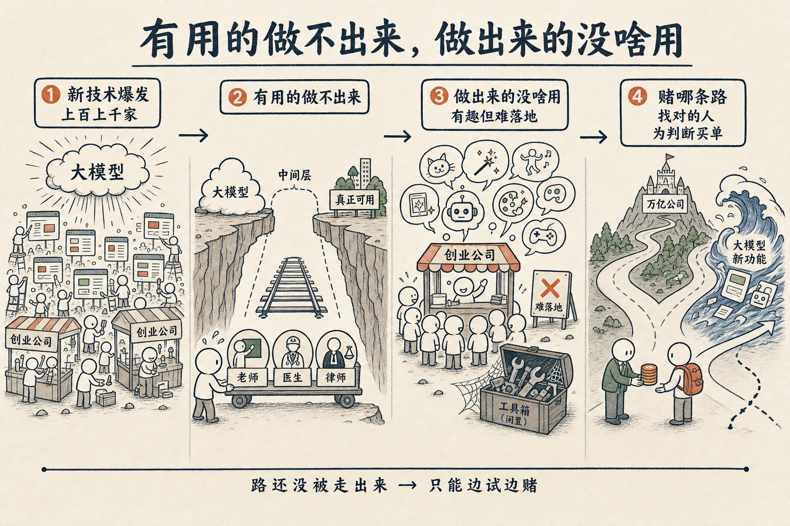

# 凡是有用的做不出来，凡是做出来的没啥用

互联网刚出来的那几年，恨不得一天就冒出来几百个网页。那些网页，你今天回过头去看，绝大多数都灰飞烟灭了。

我之所以提这件旧事，是因为现在 AI 创业的那一层，出现的问题，跟当年一模一样。

我把它总结成一句话：**凡是有用的做不出来，凡是做出来的没啥用**。

一个新技术刚刚产生的时候，总会有这么一段很有意思的繁荣期。AI 已经很强了，但是离真正的有用，它一定还需要一段时间。

为什么说有用的做不出来？

举个例子。从 ChatGPT 出来，到编程真正可用，也走了大概两三年。我甚至猜测，哪怕是最早的 3.5 版本，和今天的 Claude Code 搭配来用，效果应该都已经很不错了。问题不在模型。那个时候只有大语言模型，而上面那一层——现在大家说的 Harness，cursor 也好、Claude Code 也好——还没有 ready。大家都还在摸，没摸出这条路。这条路，就摸了两年。

那老师、医生、律师呢？从有了大语言模型，到真正可以让大家很放心地交给它去做，可能还要三五年，甚至五六年。

而这中间这一整段时间，创业公司就被困在那个状态里了。

有用的做不出来，那创业公司只能退而求其次，做什么呢？做出来很多有趣的东西，但实际上没法真用。

这不是它没本事。这是它的定义。

它一定是做出来了、且没啥用，所以它才会一直保持在创业公司那个状态。一旦变成做出来了、且非常有用，它就成了下一个 Anthropic——一个万亿公司。

所以这里有个很朴素的判断方法。
它只要还没成为万亿公司，
还需要让大家投资，
那你就知道，它还没走到"做出来的东西真有用"那个位置。

这段时间，就是**上百家、上千家、上万家公司**在一起找机会的一种焦灼状态。这是常态，不是出了什么毛病。往后慢慢稳定下来，就不至于有这么大的变化了。

困难也正在这里。

你很可能投了一家公司，觉得它做得很好，结果下一阶段，大模型一个新功能迭代，就把它整个包进去了。这样的事我看到太多了。

那怎么办？

回到互联网那个每天冒几十万个网页的状态，最关键的，还是找到那个对的人。可你很难去定义什么叫"对的人"。你只能按结果——结果好的，你就认为你找到了对的人。这件事，真的没有办法说清楚。

所以这个阶段的投资逻辑，本质上就变了。变成了你 bidding 一条什么样的路径，去找跟这条路径相应的、匹配的人，让他替你实践这个判断。

只能是这条路。但你就得**为你的判断买单**。

新技术刚冒头的那几年，从来都长这样。不是因为人不够聪明，也不是因为有人在骗钱，是因为路本身还没被人走出来。能做的，就是看清楚自己在赌哪一条路，然后认。

