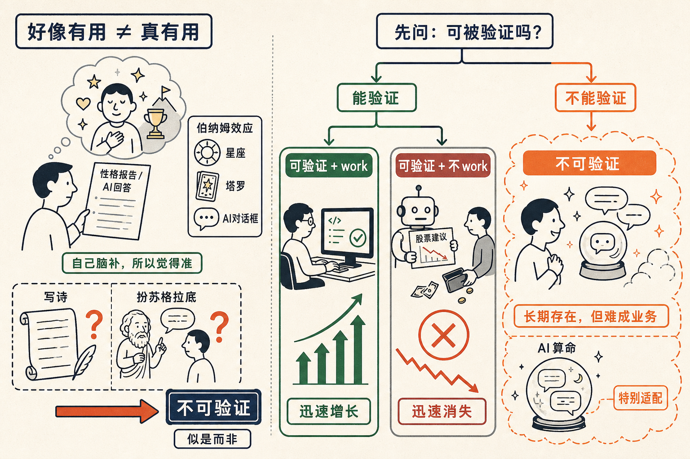

# 「有用」和「好像有用」是两回事

我现在看到创业方向上最大的一个误区，是把两个完全不同的东西当成了一个：**有用**，和**好像有用**。

大多数 AI 应用，给人的是一种好像有用的感觉。但它不是有用。

大家用 AI 的时候，一定要小心一个东西，叫伯纳姆效应，也叫福勒效应。

伯纳姆效应解释了一件事：为什么星座是 work 的？为什么八字、血型、塔罗牌、属相，会让人觉得那么准？1948 年，心理学家福勒找来 39 个学生，每人做一份性格测试，再发回一份性格报告，让他们打分——5 分是「这 exactly 就是我」，0 分是「胡说八道」。结果大家平均打了 4.3 分，觉得非常准。

但其实，所有人拿到的是同一份，一模一样的东西——那段话是福勒从一本星座书里东拼西凑出来的。

为什么会这样？因为不管那份报告写了什么，人都会在结果之上叠一层自己的理解。这层理解里加了只有你自己才知道的信息，所以你会觉得它特别准。

AI 也一样。大语言模型最早的应用就是写诗，现在没人用它写诗了——你怎么看怎么觉得像那么回事，可它能用吗？你甚至连判断力都没有。还有让 AI 扮苏格拉底，你对苏格拉底没了解的时候，觉得他说的特别有道理；真去研究过的人会发现，他根本就不是苏格拉底。

似是而非，让你觉得有用，实际上没那么有用。

**让人觉得有用，不是市场价值，真有用才是**。

## 世界会分成三坨

为什么代码生成在这么多应用里异军突起？因为它**可被验证**。

你用大语言模型炒股，它每天给你推荐股票，但你一按它的去炒，必然亏钱——这个产品就没法成立，因为它可被验证地不 work。Coding 不一样，写出来的代码跑不跑得通，立刻见分晓。可验证，就变得很有价值。

所以我觉得世界会形成三坨东西。

第一坨，可被验证、而且 work 的，涨得非常快，迅速占领市场。
第二坨，可被验证、不 work 的，不用谈了，迅速消失。
第三坨，剩下 99% 的公司，都在中间——不可被验证的 work。

第三坨有一种欺骗性。用户会跟你说「我挺需要的」，用起来也很开心，于是它长期存在在那里。但它不是一个可行的业务模式。

顺着这个逻辑，AI 算命是一件特别 fit 的事。算命无法验证，AI 做出来的东西也无法验证，而让它做无法验证的事，正是 AI 最擅长的。这不就巧了吗？一拍即合。

下回再看到一个让你觉得「好像有用」的 AI，先别急着叫好。先问一句：它，可被验证吗？

