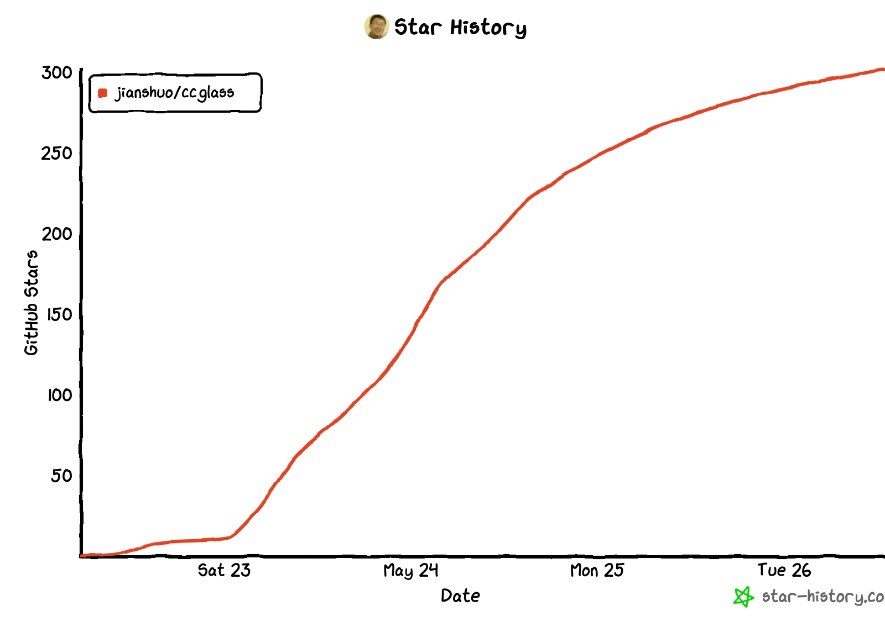

# ccglass 0.6.0 版本新功能

ccglass 是我自己写的小工具——一个本地的日志反向代理 + 网页面板，让你看见自己的 coding agent 到底往模型发了什么。

claude-trace 这些挺好的工具，因为 Claude 改了架构没法继续用了，我又有自己的研究需求，就写了一个。没想到在 Github 上拿到了 300 个星星，说明是大家共同的痛点，所以前不久花了些时间维护（其实，所谓的维护，就是在 issue 后面 @claude 一下，然后把它提的 PR 认真地看一遍）。

下面是这一周里加入的新功能。

## v0.5.0（2026-05-26）

- #50 dashboard 升级：每条请求的延迟、首字时间、吞吐速度；延迟趋势图；按模型过滤；session 维度统计；浅色 / 深色主题（@KorenKrita）
- #49 新增 Reasonix CLI provider（@KorenKrita）
- #48 跨所有 session 的 token 用量与花费汇总（@marcuslannister）

## v0.4.0（2026-05-26）

- #45 日志改为内容寻址（git 式）存储：message、tools、system 各按内容 hash 只存一份，长会话不再平方膨胀（@jianshuo）

## v0.3.2（2026-05-25）

- #43 Codex：从 `~/.codex/config.toml` 读 `base_url`，再用 `-c` 覆盖（@jianshuo）
- #41 provider 切换器写在环境变量里的 `ANTHROPIC_BASE_URL` 也能识别（@jianshuo）
- #39 日志存到 `~/.ccglass/sessions/`，删掉项目目录也不丢（@KorenKrita）
- #38 Bedrock：改用 `ANTHROPIC_BEDROCK_BASE_URL`，代理才真正拦得到流量（@marcuslannister）
- #36 文档：补充 IDE（`proxy` 子命令）支持说明（@jianshuo）
- #34 找不到要启动的命令时，给出可操作的提示（ENOENT）（@jianshuo）
- #32 新增 codex-azure provider（Azure OpenAI）（@jianshuo）
- #29 创建代理前先校验 upstream URL 格式（@jianshuo）
- #28 检测 Codex 的 ChatGPT 登录 / websocket 模式并提醒（这种模式抓不到流量）（@jianshuo）
- #22 Windows：用 cross-spawn 可靠解析 `.cmd`，修「命令找不到」（@jianshuo）
- #20 修 Windows 下 Codex 的代理路由（@ping-coding）
- #19 处理 Responses API 的 reasoning block（查看 / 流式 / 非流式）（@jianshuo）
- #18 dashboard 显示错误和重试循环（@jianshuo）
- #17 新增 provider 预设：Ollama、LM Studio、OpenRouter、GLM、Bedrock、Vertex（@jianshuo）

## v0.3.1（2026-05-24）

- #12 修 `xdg-open` 报 EACCES / ENOENT 时的崩溃（@KorenKrita）
- #11 新增 `--env-var` 选项和 OpenCode provider（@ivanberry）
- #8 转发代理请求时拼上 upstream 的 base path（@jianshuo）
- #7 `--help` 的 export 格式列表补上 raw，去掉重复的 OPTIONS 行（@claude[bot]）

## v0.3.0（2026-05-23）

- #1 新增 DeepSeek-TUI provider 支持（@zhuangbiaowei，庄表伟）

## 感谢

这些版本里很多功能来自社区贡献，特别感谢 **@KorenKrita、@marcuslannister、@ivanberry、@ping-coding、@zhuangbiaowei（庄表伟）**。

## Star History

眼看着星星增加的趋势慢慢放缓，心里有些小忧伤，有 Github 的同学帮忙给个星星，喂养一下我的小虚荣心。

## 安装 / 升级

<section style="background:#f6f8fa;border-radius:6px;padding:14px 16px;overflow-x:auto;font-family:Menlo,Consolas,monospace;font-size:14px;line-height:1.8;color:#24292e;">npm install -g ccglass@latest ccglass</section>
