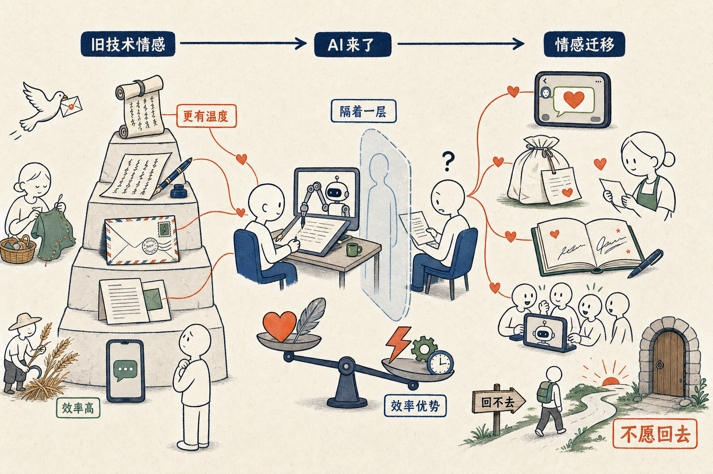

昨天关于是否应该让 AI 写文章，大家有很多讨论，比如 Green Lord 说：

<blockquote style="border-left:3px solid #d0d0d0;padding:8px 14px;margin:0;color:#666;background:#f7f7f7;font-size:0.95em;line-height:1.8;">有点疑惑在于，当我们看文章是想和作者交流时，一旦知道这篇文章是 AI 写的，仿佛心里就隔了一层，好像是中间有个代理人一样。也不知道用翻译来作为类比恰不恰当，人原汁原味的思想、表达经过 AI 翻译后，表面上看是这个意思，但是翻译和原文毕竟有着区别。如果是效率型的文字，可以让 AI 写，但如果是审美型、感受型、思想性的文字，不应该让 AI 写。（欢迎大家一起讨论）</blockquote>

我同意，任何新技术，比起旧技术，都会缺些什么。问题是，得到的比失去的，是不是值得。和效率比起来，我们曾经在乎的那些是否需要放弃。

对于这种说不出的「心里隔着一层」的感觉，我用同样的逻辑来造句：

- 手机上收到的消息虽然好，但比不过打印出来的信有诚意；打印出来的信，缺失了钢笔写的温度；钢笔写的信，没有毛笔写的信那样的美感；
- 机器产的麦子，虽然很便宜，但是缺少了以前那种手工种出来的烟火气；
- 白话文虽好，但是不如古文那么有看头；
- 恋爱自由、离婚自由的现代社会，比起原来媒妁之言、从一而终的老式婚姻，总少了一丝厚重；
- 工业化生产的衣服再好，就是比不上妈妈亲手缝的衣服饱含深情。。。

我完全不否认不同技术产生了感觉上的差异，但差异中失去的部分，和换来的成本效率优势比起来，我们应该如何取舍？

**历史告诉我们，技术总会碾压一切情怀。**

我们曾经把太多这件事情本身之外的事情，因为技术的限制，叠加在了技术本身；而在技术前进的时候，又被剥离了。但这些依附于老技术的东西，**会重新找到新的技术去依附**。

母爱，会慢慢地不再仅仅依附于手中线，也不仅仅依附于为孩子手洗衣服，而是依附在帮孩子点的一份外卖里；相思，不再依附在红豆上、飞鸽传书中，而是依附在微信的消息中；读者那种花大时间的仪式感，也不再依附于低效率的小肉手打字，而将找到新的东西依附（比如签名书，就是一种毫无技术必要性，却可以附着一层情感的仪式）。

我们或许明年，就会怀念那种大家用小肉手来交流的年代吧，就如同怀念一切我们小时候经历过的那些「纯情」年代一样，但我们回不去。

**不是不能回去，而是不愿意回去。**
