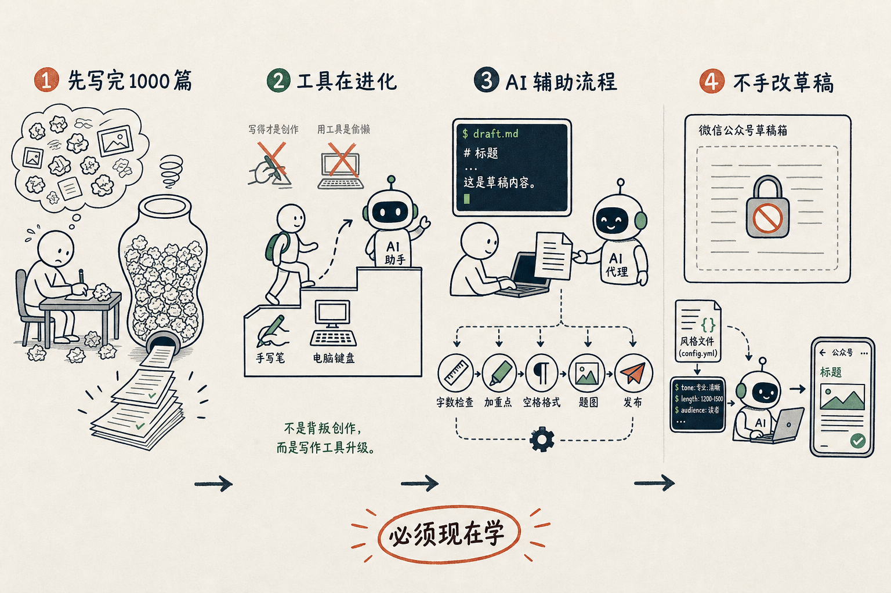

到底该不该用 AI 写文章？

我的结论：**必须**。需要现在就开始学习。

AI 写文章不是由它来写，而是学会一种架构让它帮助自己把整个流程自动化，同时给辅助。我给自己定的死目标是：**以后绝不在微信公众号的草稿箱里面改一字**，所有的改动都要通过 Claude Code 来改。改的方式，除了告诉他哪一句需要怎么改以外，其他的方式包括去改风格定义的文件，去约束他未来的更改方向。

这的确开始的时候非常不顺手，就如同刚刚学骑自行车一样，明明上手就能搞定的事情需要绕一大圈，但这是学习的必备过程。婴儿学什么都快，一个优势就是他不执着于自己曾经会的那一种方式。

我现在的工作流，就是在命令行写文章，然后交给 Claude Code 的 wjs-publishing-wechat skill，去生成最终的版本。这个 skill 我开源了，文末附了安装方法，感兴趣可以拿去。

他会帮我做一堆琐碎的事情，包括 5% 以内的修改、字数的 check、加重点、盘古之白、做题图还有发布草稿等一系列工作。这些要说是写作的一部分，也可以说不是一部分，都是琐碎的，写作的附带品。

我喜欢绘画，我喜欢一句话：「每个人身体里都有 1000 幅难看的画，把它们赶紧画完，身体里就只剩下好看的了」。我们每个人身体里也有 1000 篇 AI 感十足、写得很差的文章，**先把它们写完，剩下的就是好的了**。

过了几代人，总算没有人说「打印出来的东西没有诚意，必须手写了」，也没有人说「用电脑写出来的东西不叫创作，作品没有『手稿』就不值钱了」，我嘲笑上几代人的时候，自己却对 AI 写出来的东西极力抗拒。

最近的文章，评论下面总会有关于「是不是 AI 写的」的疑问，我可以确信地告诉大家，**100% 是 AI 辅助的，我自己不改一字**。但是，千万不要把用 AI 写当作一件简单的事情，现在哪一篇文章不是「电脑」写的呢？不要以为会用键盘打字，就会用电脑写文章，那只是打字员；也千万不要以为会跟 ChatGPT 聊天就会用 AI 写文章。

我们很多时候被一件事卡住，就以为别人只是跨过了那一步；等自己走过去，才发现到想去的地方还有另外的 50 步。我们以为别人穿得好看只是因为有钱，后来才发现，还差了品味；Google 以为当年在中国失败是因为被封了，后来才知道差了用户体验。我们看到的，只是自己看得到的那点障碍，走过去了才知道，那不过是个开端。

这是一个漫长的学习和适应过程，我们需要一起走过去。

## 安装方法

先说清楚：**这个 skill 是我给自己用的**，按我自己的习惯和环境长出来的，别人拿去用，估计会磕磕绊绊。但既然开源了，想试就试。

不用复制命令。打开你用的 AI agent——Claude Code、Codex、Kimi Code、OpenClaw 都可以，对它说一句：

> 安装 https://github.com/jianshuo/claude-skills/blob/main/wjs-publishing-wechat/SKILL.md

它会自己 fetch、放到 skill 目录里、提示你重启对话。装完之后，在命令行写好草稿，对它说一句「帮我发这篇公众号」，就能用。
