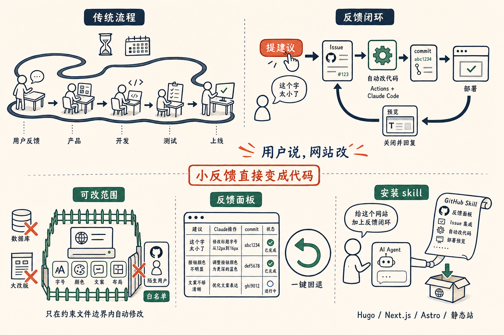

上周在播客里和任鑫介绍过我前面一直在跑的一个功能：**在网站上加一个「提建议」的对话框，访客说一句话，网站自己改自己。**

具体做法是：访客点按钮，填一句建议，变成一个 GitHub Issue，Actions 触发，Claude Code 读我写的约束文件，直接改代码，commit 推到 main，自动部署，Issue 关闭，回复里附着 commit 链接和预览地址。全程不需要人参与，耗时五分钟左右。

我把这个叫**「反馈闭环」**。

传统产品迭代是这样的：用户反馈 → 产品经理消化 → 开发排期 → 测试 → 上线。每一步都有人在中间，快的话两周，慢的话两个月。好的反馈死在排期里，不是什么罕见的事。

反馈闭环跳过了所有中间环节。用户说，网站改。

---

还有一个 `/_feedback` 面板。每条建议、Claude 做了什么、commit 是什么、当前状态，全在那里。不满意，一键 revert，驱动方式和提建议完全一样。以前是先决定要不要做，再去做；现在变成了先做出来，然后我们看到了真实的产品，再决定要不要扔掉。

真正有用的产品反馈，来自具体的人说的具体的话。「这个字太小了」「这里的描述看不懂」，比任何数据分析都直接。但多数反馈死在流程里——太小，不值得排期；太多，没人处理得完。

**闭环的价值在这里：让原本会被忽略的小反馈，直接变成代码。**

字号、颜色、文案、布局细节，这类改动完全可以交给用户驱动。大改动、涉及数据库的，还是要人来。这套机制不是要替代产品判断，是把那些「知道该改但一直没空」的小东西，从待办清单里解放出来。

---

我把它做成了一个 skill，叫 `wjs-looping-feedback`。支持 Hugo、Next.js、Astro 和静态站。用的是自己的 GitHub Actions 和 Claude Pro/Max 的 OAuth token，不需要另外付费，也没有后端服务。

这是我给自己用的东西，别人装估计磕磕绊绊。但还是开源出来了，说不定有人觉得有用。

## 安装方法

不用复制命令。打开你用的 AI agent——Claude Code、Codex、Kimi Code、OpenClaw 都可以，对它说一句：

> 安装 https://github.com/jianshuo/claude-skills/blob/main/wjs-looping-feedback/SKILL.md

它会自己 fetch、放到 skill 目录里、提示你重启对话。

装完之后，对 agent 说一句「给这个网站加上反馈闭环」，就能用。
