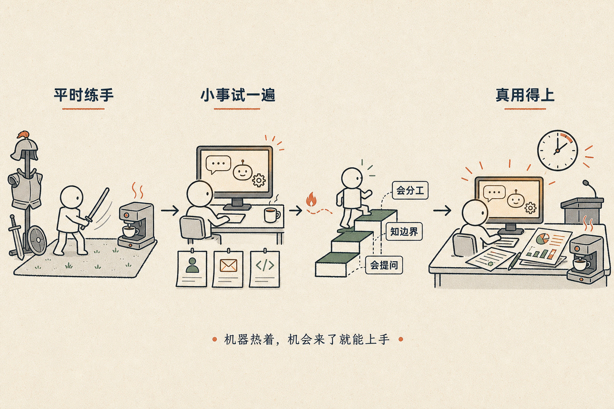

# 我们总得干点啥

前两天跟一个朋友聊，他问我：普通人现在应该怎么学 AI？

我说：找一件没意义的事，用 AI 做一遍。

他愣了一下：没意义的事，做了有什么用？

## 解甲之后也要修真

这话看起来矛盾，但我认真的。

中国有个说法叫"解甲归田"。打完仗的武士，铠甲脱了，刀收起来，回去种地了。如果从此再不练，过个三五年，手是抖的，再拿起刀来，已经是废人了。

真正聪明的那批人，解甲之后选择修真——不是为了打仗，就是为了让自己一直维持在那个状态里。

我们现在面对 AI，就是这种处境。

## 让机器永远热着

我有一台老咖啡机，要预热，得等五到十分钟。每次赶时间就后悔——要是一直开着就好了。

AI 技能，也是这样的东西。

- 用它整理一下通讯录
- 让它帮你把一封邮件改得更正式
- 用它生成一个根本不会用的 Python 脚本

这些事做出来，可能没什么用。甚至有点浪费时间。

但机器热了。

下次真正需要的时候——一个截止日期迫在眉睫的报告，一个突然要做的演讲——你的第一反应不是"那个工具叫什么来着"，而是直接动手。

## 没意义的练习，是有意义的

你在做一件没意义的事，但正是这件没意义的事，让有意义的事变得可能。

找一件手边的小事，问自己：这件事，能不能用 AI 重新做一遍？

就算做出来效果不好，就算最后还是用回老方法——

- 你学到了怎么提问
- 学到了 AI 在哪儿靠谱、在哪儿不靠谱
- 学到了什么任务可以交出去、什么任务必须自己来

这些认知，只能在做的过程里长出来。看视频、读文章给不了你。

## 总得干点啥

不是说要焦虑，不是说要放下一切去学 AI。

是说：今天就找一件小事，不管有没有意义，拿 AI 试一遍。

机器一直热着，总有需要它的那天。

