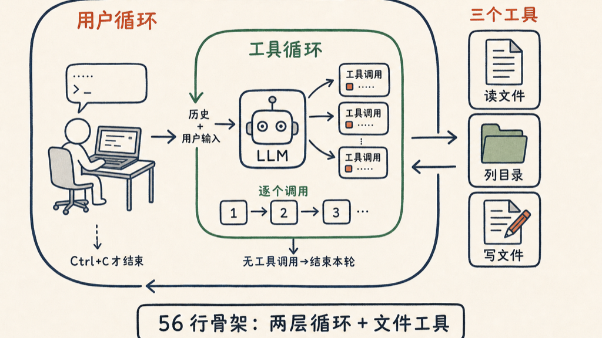

Claude Code 虽然很复杂（50 万行），但是却非常精巧。从本质上来说，就是两层 `while(true) {}` 的循环，组织起来的读写查文件三个工具调用。我用了 56 行，复刻了一下 Claude Code 的最核心代码，虽然不能真的做到平替，但是写些简单的代码是可以的，最主要是理解 Claude Code（或者大多数 Agent）的工作原理。以下是全部代码，Github 源代码放在「查看原文」里面。

**两层循环**

最外层，就是最后四句，收到一个用户输入，把它和历史一起开启一个内部的小循环。

这是那个内部的小循环：

两个都是死循环。

前一个大循环（User Loop），只有当用户输入 `Ctrl+C` 强行中断的时候跳出，第二个小循环，只有当 `tool_calls.length == 0` 的时候跳出。也就是说，只有 LLM 回复要求的工具调用都调用完毕以后，这一轮交互才算真正结束。

最里面有一个很小的循环，就是如果 LLM 同时要调用多个工具，就一个一个按顺序调用本地的工具完成。

没了。就这么简单。主要代码完毕。

**工具定义**

上面就是两个函数定义了一下工具。一个是真正的定义，里面只定义了三个代码 Agent 至少要用的工具：一个是读文件，一个是读文件夹内容，一个是写文件。都是最简单的文件操作。当然 Claude Code 内置了四十几个工具，大家可以从泄漏的代码的 Tools 文件夹里面看到，每一个工具的定义不比我下面定义的复杂多少。

在后面就是把这几个工具变成一个 JSON 数据传给 LLM 就好了。

最终生成的 JSON 格式就是这样，原封不动的给大模型就行：

<section style="background:#f6f8fa;border-radius:6px;padding:14px 16px;overflow-x:auto;font-family:Menlo,Consolas,monospace;font-size:14px;line-height:1.8;color:#24292e;">[   {     type: 'function',     function: {       name: 'read_file',       description: 'Read a file.',       parameters: [Object]     }   },   {     type: 'function',     function: {       name: 'list_files',       description: 'List files in a directory.',       parameters: [Object]     }   },   {     type: 'function',     function: {       name: 'edit_file',       description: 'Write content to a file.',       parameters: [Object]     }   } ]</section>

LLM 会根据上下文和你提供的工具，找到合适的工具，把最终的项目完成。

就是这简单的 56 行，是大多数 Coding Agent 的骨架。在这之上可以加很多更多的功能，比如 Skills 的支持等。

