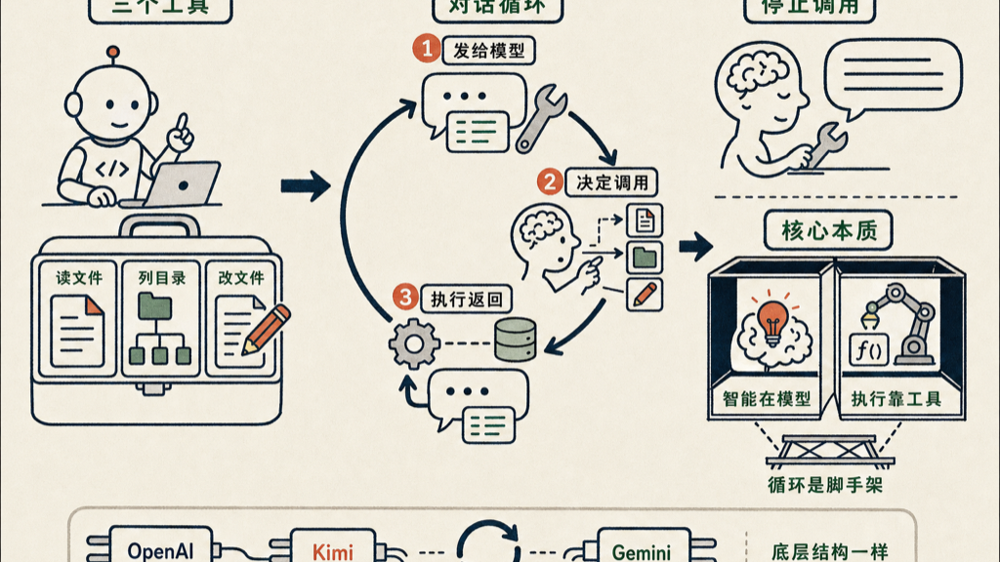

Claude Code 的核心，56 行代码就能搓出来。

我最近把它实现了一遍，用的是 Moonshot 的 API，放到 GitHub 上了。代码不到 60 行，能问文件、能改文件、有完整对话历史，是一个能跑的编程助手。

**那 Claude Code 到底在干什么？**

说穿了就两件事：给模型一批工具，然后让他不停地循环，直到他不再调用工具为止。

工具只要三个就够：

- `read_file`：读一个文件
- `list_files`：列出目录里有什么
- `edit_file`：把内容写进文件

这三个工具覆盖了编程助手 90% 的文件操作。读代码、看目录结构、改文件——写代码这件事，本质上就这几个动作。

循环是脚手架，智能在模型里。

每一轮，把对话历史和工具定义一起发给模型，他决定调不调工具。调了，就执行工具、把结果塞回对话；不调了，他直接回答，这一轮结束。这就是所谓的 agent loop，`while true` 里面三十行。

搓这个的最大收获，不是「我会写 agent 了」。是我终于搞清楚 Claude Code 在做什么。

他在「想」的时候，其实是模型在决定下一步该调哪个工具、参数填什么。他在「执行」的时候，是真的在跑函数、读磁盘。不是魔法，是一个带工具的对话循环。

拆开盒子，才能真正用好它。

同理，OpenAI 的 function calling、Kimi 的工具调用、Gemini 的 code execution——底层结构都一样。换个 API key 和 model 名字，这 56 行可以接任何一个。

这个项目叫 `mini-claude-code`，是我给自己理解用的玩具。没有 token 预算管理，没有错误恢复，没有 streaming。但他能跑，跑起来你就知道 Claude Code 骨子里是什么了。

代码在 https://github.com/jianshuo/mini-claude-code，56 行，自己看。
