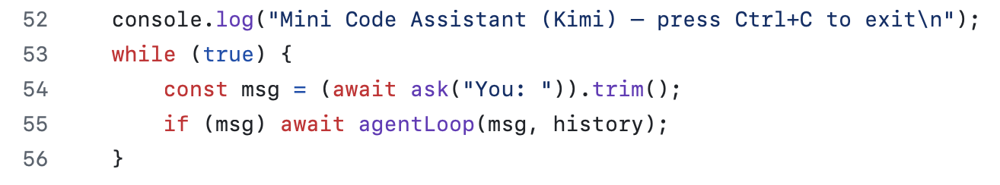
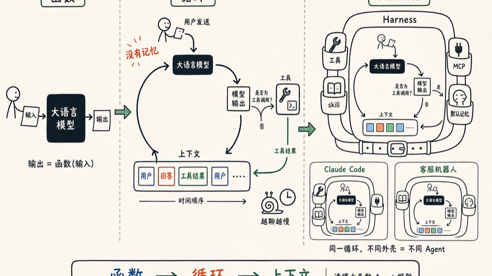

**大语言模型(LLM)可以被看成一个函数。**

你给他输入，它给你输出。

`输出 = 函数（输入）`

**Agent 是什么？是一个 `while(true)` 的死循环**

而且是永不退出的那种，除非你按 Ctrl+C。

它拿到你的输入，送给大语言模型，然后把你的输入和模型输出，一起塞进一个数组，然后继续等你的下一个输入，把它也塞进数组，再次整个发给模型。如此往复，直到永远。这个数组，我们叫它「上下文」。

大语言模型没有记忆。每次你以为他「记得」，其实是他把从第一次循环开始到现在的所有内容——你说的每一句话、他的每一个回答、每一次工具调用的结果——全部打包成一个越来越长的数组，整个发给模型。

**那 Harness 是什么？是这个死循环里除了用户输入之外的所有定义**

- 有什么工具可以用？
- 有什么 skill？
- 连了哪些 MCP？
- 上下文里默认带了什么记忆？

这些东西放在大语言模型和用户之间，给循环套上一层壳，这层壳就叫 harness。

同一个 while true 循环，不同的 harness，就是不同的 Agent。Claude Code 是一个 harness，你公司的客服机器人也是一个 harness。区别不在循环，在循环里装了什么。

理解了这三件事——函数、循环、上下文——基本上就能读懂现在大多数 Agent 框架的文档了。

<<<<<<< HEAD
<<<<<<< HEAD

=======

>>>>>>> 88626e6d4918e78e2251fb8f08b0d86da294a476

上面这段代码大约就是这个死循环的样子，它是 Claude Code 代码里面最重要的两个循环之一。我写了一个 56 行代码的 Mini Claude Code，就可以实现基本的编程工具，源代码在「阅读原文」里面。
=======

>>>>>>> worktree-virtual-waddling-panda

<<<<<<< HEAD
上面这段代码大约就是这个死循环的样子，它是 Claude Code 代码里面最重要的两个循环之一。我写了一个 56 行代码的 Mini Claude Code，就可以实现基本的编程工具，源代码在「阅读原文」里面。

=======
>>>>>>> 88626e6d4918e78e2251fb8f08b0d86da294a476

