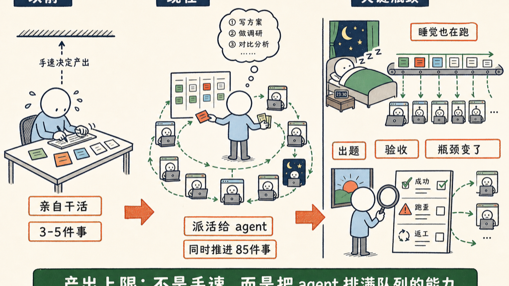

硅谷的工程师现在最大的焦虑，不是活干不完，而是我睡觉了，agent 还没任务。

这不是段子。昨天和一位老朋友对谈，我给他看我的 AI 使用报表，他指着曲线问：

<blockquote style="border-left:3px solid #d0d0d0;padding:8px 14px;margin:0;color:#666;background:#f7f7f7;font-size:0.95em;line-height:1.8;">你睡觉的时候，怎么还会有使用量呢？</blockquote>

因为我睡觉的时候，他在帮我跑一些循环。我一定要在睡前把 agent 全部跑满，才安心去睡。

先交代一下我的工作强度。这份报表是我自己用 AI 做的小工具统计的，蓝色是 Claude Code，另一条是 Codex：

- 每天晚上 12 点、1 点还在干，大多数时间凌晨 3 点睡，一大早起来接着干
- 每天用 AI 5、6 个小时
- 同时干着 85 件事——这边一栏是正在干的，那边一栏是干完的
- 开发只占 29%，剩下是写文章、做视频、弄网站、公司业务，各种杂项

注意那个 85。我一个人，同时推进 85 件事。这些事有大有小：大到一个网站的改版，小到把一段视频转成字幕。

放在两年前这是不可想象的。一个人同时能推进的事，撑死三五件，再多就顾不过来了。

**变化在哪里呢？**

人的瓶颈，从「干活」变成了「派活」。

以前你的产出上限是手速：一天写多少行代码，写多少个字，开多少个会。现在干活的是 agent，你的上限变成了另一个东西——能不能源源不断地出题，派给他。

agent 不累、不睡、不嫌活多。他闲着，不是他的问题，是我出不了题了。

有人心疼 token，觉得跑这么满是不是太浪费。我的看法正相反：现在限制你的是脑子，不是钱。token 越来越便宜，攒着不用才是真的浪费。

派活也是个手艺。一件事拆到多细、说到多清楚、边界画在哪里，他才能自己跑完不歪——这跟带一个新员工是一模一样的。

而且题目出完了还不算完。第二天早上起来，我要一件一件验收：哪些跑成了，哪些跑歪了，哪些要返工。出题和验收，占掉了我一天里最多的时间。

这像什么呢？像一个小老板突然有了一百个勤快员工。员工个个不知疲倦，老板第一次发现，瓶颈是自己脑子里的任务清单。

以前「派活」是管理者才需要的能力，一家公司里只有少数人操心怎么把任务拆开、排好、分下去。大多数人一辈子只需要把分到自己头上的活干好。

现在不一样了，每个用 AI 的人都需要这个能力。学校没教过这门课，只能自己练：每天睡前问自己一句，今天我出了几道题？

你的产出上限，不再是你的手速，是你给 agent 排满队列的能力。

所以我每天睡前的最后一件事，是检查还有谁闲着。都跑满了，我就安心去睡了。

