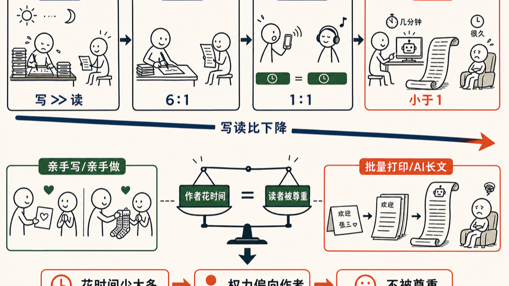

看到一篇文章，只要能感知到它是 AI 写的，我们就会有一种被冒犯的感觉——觉得自己没有被尊重，不太想读下去。注意，这种感觉发生在我们判断他写得好不好之前。

这是为什么呢？

以前研究视频的时候，我提出过一个概念，叫「写读比」：作者写一段内容花的时间，比上读者读它花的时间。它看起来是技术的选择，但实际上是一种权力的划分。

把每个时代的写读比排出来，事情就清楚了：

| 时代 | 写 | 读 | 写读比 |
|------|------|------|--------|
| 古文 | 好几天 | 一分钟 | 远大于一 |
| 白话文 | 半小时 | 五分钟 | 六比一 |
| 语音 / 视频 | 一分钟 | 一分钟 | 一比一 |
| AI | 五分钟 | 二十分钟 | 小于一 |

古文时代，写一首诗或者一篇文章要花好几天，读的人一分钟就读完了。写的人付出巨大的精力，所以权力在读者这边。

白话文以后，写东西不那么费脑子了。大白话怎么说，就怎么落笔，从口语转成书面语的那部分努力省掉了，写读比降到六比一。

到了语音和视频，不借助技术，写读比就是一比一：我发一分钟语音，你就得花一分钟听。这就是为什么微信群聊里大家这么讨厌发语音的人——发的人和听的人的权力被拉平了。而转文字、倍速播放，都是为了把权力再还给接收者。

AI 又不一样了，他把写读比彻底翻了过来。我花五分钟生成的一篇文章，你可能要读二十分钟。这可能是人类历史上第一次，写读比小于一。权力进一步从读者手里，转移到了作者那边。

所以我们感受到的不仅是信息的差异、工具的差异，而是发信息的人和读信息的人之间权力的差异。

把内容的好坏放到一边，只看情绪，你会很明显地感觉到：对方和自己所花时间的比例，约等于自己被尊重的程度。

朋友亲笔给你写一张贺卡，你会觉得很温暖；他亲手给你织一双袜子，你会觉得很幸福。这种幸福感不来自东西本身的实用性，而来自另外一个人肯为你花时间。

住酒店的时候，经理手写一份欢迎信，你会感觉很好。如果是打印的呢？上面有自己的名字，感觉还稍好；连名字都没有、一看就是一次打了一千页的，就只剩被敷衍的感觉了。

所以，回到最初的命题。我们觉得 AI 写的东西冒犯了自己，不是因为他写得差，而是作者花的时间比原来少了太多，权力向他那边倾斜，我们觉得没有被尊重，于是有了被冒犯的感觉。

但我们总要接受这种感觉。我们一路被冒犯走过来。我们被午餐肉冒犯，被预制菜冒犯，被玻璃冒犯，被群发拜年短信冒犯，背后都是随着技术的发展，导致我们无处不在的新技术包围后的不爽感。

后注：说到午餐肉，或许 SPAM 的例子最说明问题。SPAM 本来是人家 Hormel 公司 1937 年的创立的火腿肠品牌，知道现在我还是依然喜欢去超市买 SPAM 牌子的午餐肉吃。但就是太美味，廉价，市场营销又到位，导致好多参天个的各种菜都放 SPAM，直到被 Monty Python 在一个剧里面调侃：“egg and spam, egg bacon and spam, spam spam spam egg and spam“，现在成为了垃圾邮件的代名词：SPAM。很多成功的新技术都有 SPAM 的特征，包括 AI 写作。

