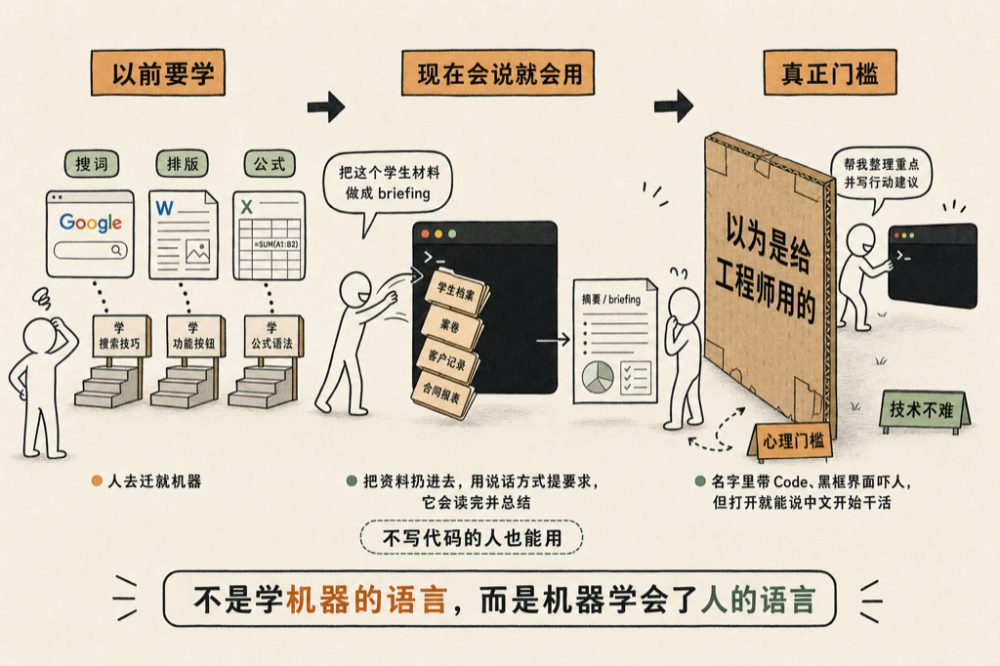

用 Claude Code，比用 Word 容易。

这话听起来不对劲：一个名字里带 Code 的东西，怎么会比 Word 容易？但我是认真的。

昨天和一位老朋友对谈，聊了一路 AI，他听得很认真，最后问了一句：

<blockquote style="border-left:3px solid #d0d0d0;padding:8px 14px;margin:0;color:#666;background:#f7f7f7;font-size:0.95em;line-height:1.8;">这些指令是不是也要学的？</blockquote>

我说，这个难度和用 Google 差不多，顶多是知道用哪几个词、要不要分开搜。真的不比用 Google 更难。

你回想一下，我们这一路用过的工具，哪个不要学：

- 用 Google，要学怎么挑搜索词
- 用 Word，要学样式、排版——有的人还真学不会 Word
- 用 Excel，要学最基本的等于号、这个单元格加那个单元格的简单加法——就这一个等于号，都有人学不会

那些都需要学。但这个，连这都不用学。

你跟豆包聊过天吧？聊过天，就算会了。跟 ChatGPT 聊过天，也算会了。会说话，就会用。

我当场就劝他用起来。他不写代码，但他总有文秘工作要做吧。他带那么多学生，把资料往里一扔，告诉他：把这个学生的相关材料给我做一个 briefing，我看了以后再跟他见面。

他不是在搜索，他是真的把里面所有的文档都给你读一遍，然后给你总结。

不写代码的人，都有这样的活：

- 老师有学生档案
- 律师有案卷
- 做销售的有客户记录
- 当老板的有一堆报表和合同

把文件夹扔给他，用说话的方式提要求，他就开始干活了。这些活以前要么自己熬夜干，要么雇个助理干，现在动动嘴就干了。

我们这代人被软件训练出一个条件反射：新工具等于报个班、买本书、找个年轻人教。所以他听我讲了一路，问的还是「要不要学」。

但这次的新东西，第一次把「学」字去掉了。以前是人去学机器的语言，菜单在哪、按钮在哪、公式怎么写；现在是机器学会了人的语言，是他迁就你，不是你迁就他。

**那为什么大家还是觉得难呢？**

因为门槛是心理的，不是技术的。名字里带个 Code，界面是个黑框框，看起来就不欢迎普通人。很多人在这一步就退回去了，连试都没试——就像当年有人觉得智能手机是年轻人的东西，结果用得最欢的是退休的爸妈。

其实你对他说中文，他就用中文干活。你不需要懂他背后是什么，就像你用 Google 的时候，也不需要懂搜索引擎是怎么造出来的。

门槛从来不在技术上，在「以为它是给工程师用的」这个念头上。

对谈结束的时候，老朋友说：

<blockquote style="border-left:3px solid #d0d0d0;padding:8px 14px;margin:0;color:#666;background:#f7f7f7;font-size:0.95em;line-height:1.8;">好的，我准备学了，明天开始用。</blockquote>

其实不用「学」。打开，说话，就开始了。

