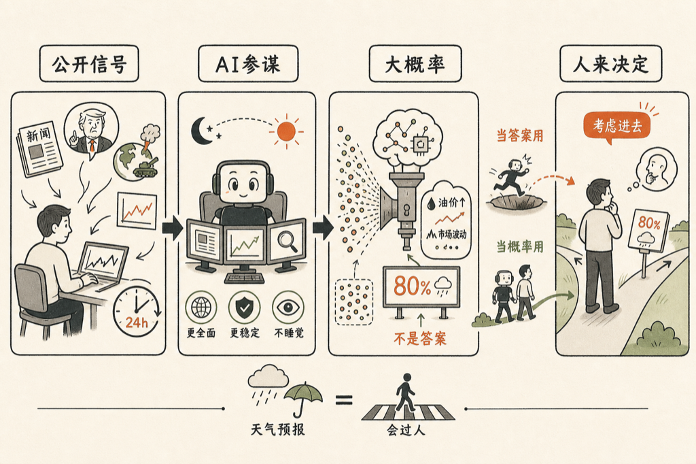

# 模型给的是大概率事件，不是答案

大模型给你的不是答案，是大概率事件。这两者的区别，决定了你能不能用好他。

最近我拉了一个群，群里有人没日没夜地拿 Claude Code 炒股。一位老朋友听了好奇：

<blockquote style="border-left:3px solid #d0d0d0;padding:8px 14px;margin:0;color:#666;background:#f7f7f7;font-size:0.95em;line-height:1.8;">用 AI 炒股，到底是在炒什么？</blockquote>

我转述一下那个人干的事，说穿了很朴素：

- 打仗的时候，搞明白各个国家的指数；
- 特朗普每天发 Twitter，每条 message 对市场有什么影响，立刻分析出来；
- 二十四小时盯着，不吃饭，不睡觉。

他不靠研报，也不靠内幕，就是让 AI 把公开世界里的信号一条一条接住，一条一条算过去。

这些东西人的脑子也能想得过来，但人没办法想得那么全面、那么 consistent。AI 的优势不是更聪明，是更全面、更稳定、不睡觉。

我看了都觉得壮观。一个人加一个不睡觉的 AI，干的是过去一个研究所的活。人在睡觉，他在看盘；人在吃饭，他在读新闻。

先说清楚，这不构成任何荐股啊。我自己没这么干，我只是看着群里的人这么干，看明白了一件事。

**那他给你的到底是什么？**

模型给的这些分析，很多其实是 common sense。特朗普说我要打伊朗了，那油价肯定就涨了嘛——这个「肯定」是谁决定的？是模型本身，是他压缩在大模型里的 knowledge。

换句话说，`输出 = 历史的概率压缩`。他给你的是历史上大多数情况下会发生的事，不是这一次一定会发生的事。

很多人在这里栽跟头：模型说得有条有理、信心十足，他们就把这句话当成了答案，照着下单。错不在模型，错在不理解模型给的是什么。

概率这个东西，人天生不擅长。模型把概率说成了流利的句子，人就更容易忘了那是概率。

天气预报说降水概率百分之八十，你出门会带伞，但你不会因为那天没下雨就去砸气象台。模型也是一样的道理。

他是个工具。你知道这个工具能给你什么，就行了。他不见得是唯一解。

就像路上的斑马线。斑马线不是说你不能踩上去，是告诉你：这个地方会过人。你要理解什么叫斑马线。

他告诉你特朗普说了这句话、石油会涨，那石油不见得真的会涨。但那是按照历史上大多数情况给出的一个大概率事件，你做任何决定的时候，把这个大概率事件考虑进去，就够了。

把他当答案用，迟早摔跟头；把他当大概率事件用，他就是你身边那个不情绪化、不睡觉的参谋。

工具给的是概率，决定还是你来做。

