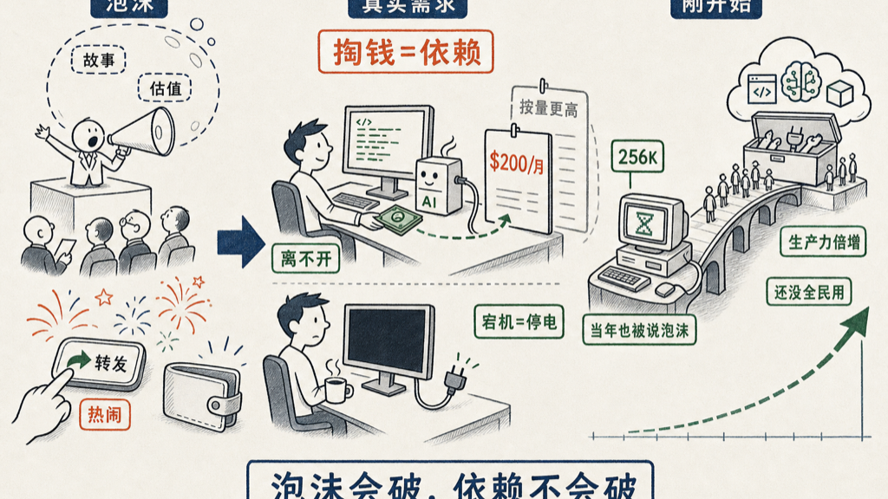

# 绝对不是泡沫

现在的硅谷热火朝天。不是泡沫，绝对不是泡沫，这是实打实的需求。

这话是我昨天跟一位老朋友说的。他问我：

<blockquote style="border-left:3px solid #d0d0d0;padding:8px 14px;margin:0;color:#666;background:#f7f7f7;font-size:0.95em;line-height:1.8;">那现在硅谷怎么样？</blockquote>

我的回答就是上面那句。判断是不是泡沫，我有一把最简单的尺子：付费意愿就是依赖度。故事撑起来的估值，用户是不掏钱的；需求撑起来的估值，用户抢着掏钱。

判断的时候不用看分析师的报告，看自己的手就行。
手在掏钱，就是真的。
手在转发，就只是热闹。

Claude Code 一个月收 200 美金，即使中国的程序员，基本上也都付了。「即使」这两个字我是故意用的——让中国用户为软件按月付钱，是过去二十年最难做的生意，现在没人犹豫了。

所有用过的程序员，离开他就跟傻子一样，啥都不会干了。

我自己的账单更说明问题：

- 我每个月付 200 美金的订阅；
- 但按实际用量计费的话，我每个月大概要用掉 4000 美金的量。

必然会发生的一件事情，是他取消 200 美金的定额。哪天他让我付 400，或者 1000，我估计还得付。因为你已经离不开了，要不然就跟傻子一样。

你怎么知道自己依赖电？停一次电就知道了。Claude Code 哪天宕机几个小时，全世界的程序员大概只能坐在那儿喝咖啡，等着来电。

这就是泡沫和需求的区别。
泡沫是讲给投资人听的故事。
需求是从用户口袋里长出来的账单。
一个产品涨五倍价用户还得付，那不是故事，那是水和电。

所以无数的人、无数像我这个年纪的人，现在没日没夜地编程。干嘛呢？太多以前想做做不了的事情了。没有人逼，也没有什么 KPI，就是手痒——那些想了很多年的东西，突然全都够得着了。

硅谷现在还流传一个判断：大家认为做 Claude Code 的 Anthropic，会是人类历史上第一个年收入超过 1 万亿美金的公司。这话我只是转述，信不信由你。但方向我是信的——这不是泡沫，是一个生产力的巨大的倍增器。

而且现在才有多少人在用这东西啊？只是一小撮先进的工程师。如果每一个人都用的话，那是想象不到的量。

你记得咱们刚刚上网的时候吗？256K 拨号的时候，你能想象现在吗？

那时候打开一张图片，要看着它一行一行地刷出来，也有人说互联网是泡沫。二十多年过去，吵的人散了，网一天都没停过，长成了当年谁也想象不到的样子。

泡沫破掉的是估值，破不掉的是依赖。我们现在就站在 256K 的那一年。

