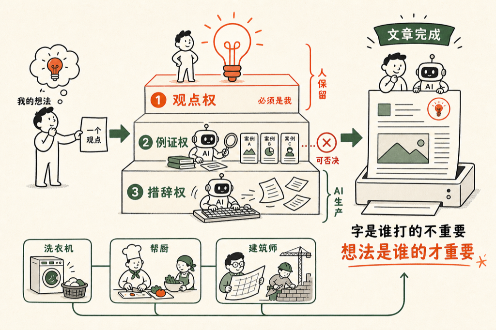

# 公众号全是 AI 写的，想法是我的

你现在看到的这个公众号，没有一个字是我打的，但每一个想法都是我的。

昨天我开车去接一位老朋友，路上手机里那篇刚发的文章，就是出门之前让 AI 写完的。他坐在车里翻了翻，问我：

<blockquote style="border-left:3px solid #d0d0d0;padding:8px 14px;margin:0;color:#666;background:#f7f7f7;font-size:0.95em;line-height:1.8;">文章也是完全用 AI 写的？想法肯定是你的，这没问题吧？</blockquote>

对，没问题。我基本上跟他口头说就行了，写文章给的指令会多一点，但也就是口头说。

口头说，是这件事最被低估的部分。我不填模板，不背什么 prompt 套路，就像跟一个熟悉我的编辑聊天。

写一篇的实际过程是这样的：我说，我们一起写公众号文章吧。他说好，我们来写一写，有什么想法吗？我说我的想法就是这么个想法，标题《让用户按自己反馈来做东西》，接下来你来介绍吧。

就这么多。

听上去像偷懒，其实那一句话里藏着全部的工作：那个想法是我在生活里攒出来的，他只是替我把它铺开。

这个月我已经写过两篇，聊该不该用 AI 写、AI 写作的损失我接不接受。今天不聊该不该——该不该是观点之争，分工是已经发生的事实。

**那我到底还干什么？**

我把写文章这件事拆成三层：

- 观点权：这篇文章主张什么，必须是我的；
- 例证权：用什么例子、什么 evidence 撑这个观点，他可以自己去搞；
- 措辞权：每一句话怎么说，全部是他的。

我只保留第一层，外加一个否决权——例子不好，我可以告诉他：换一个，用我告诉你的这个例子。剩下的，全部交出去。

这三层里，最值钱的是第一层。例子可以换，措辞可以改，观点错了，整篇都白写。

观点权在人，生产权交给 AI。

朋友前天早上四五点钟爬起来，看了我好几篇文章。他说：

<blockquote style="border-left:3px solid #d0d0d0;padding:8px 14px;margin:0;color:#666;background:#f7f7f7;font-size:0.95em;line-height:1.8;">这个文章早晚都是 AI 写的，你不可能不走这条路。</blockquote>

我说：对啊，不可能不写的呀。

就像没有人再争论衣服该不该用洗衣机洗。衣服是谁的，怎么算干净，还是你说了算；搓的那道工序，交给机器就好了。

建筑师早就不亲手砌砖了，可没有人说那房子不是他设计的。字是谁打的不重要，想法是谁的才重要。

你此刻读的这一篇，也是这么写出来的。

