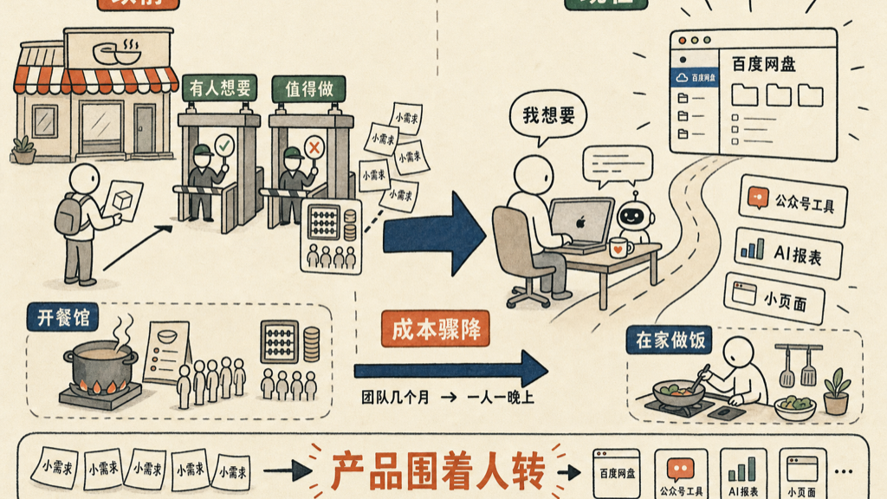

# 想了十年的产品，一晚上写出来

我想了十年的产品，上周用一晚上写出来了。

它叫 BdpanFinder，要干的事说出来很简单：在 Mac 的 Finder 左边放一个百度网盘。iCloud 用起来很爽，OneDrive 也很好，文件上上下下拖一拖就行。但百度网盘没有这样的东西，这么多年都没有。

百度网盘的速度其实很快，不是技术做不到。他们为什么不干？我猜就是市场不够大：用 Mac 的人里用百度网盘的，用百度网盘的人里在乎 Finder 集成的，一层层筛下来剩不了几个人。也可能有人做过，但太不知名，用的人太少。

我一直想要一个。那我就自己写一个呗。

一位老朋友听完问我：

<blockquote style="border-left:3px solid #d0d0d0;padding:8px 14px;margin:0;color:#666;background:#f7f7f7;font-size:0.95em;line-height:1.8;">那你要给他什么指令呢？</blockquote>

我就跟 Claude Code 说：你给我做一个像 OneDrive 一样的、可以在 Finder 里面用百度网盘的东西。就这么几句话。中间来来回回调了不少，反正干了一晚上，大概四五个小时，能用了。

以前一个产品要出生，得过两关：

- 第一关，有人想要；
- 第二关，值得做——市场够大，成本收得回来。

无数产品不是死在没人想要，是死在「值得做」这一关。想要 BdpanFinder 的人可能只有几千个，养不活一个团队，所以十年没人做。

打个比方，以前做产品像开餐馆：光自己爱吃没用，得算清楚每天有多少人来吃、客单价多少，算不过来就不敢开张。现在像在家做饭，想吃什么，下楼买个菜回来就炒了。

成本从一个团队几个月，变成一个人一晚上，「值得做」这道题就不用算了。

我这几个月给自己做的东西，全是这一类：

- 一个发公众号的工具；
- 一个报表，告诉我每天花了多长时间在 AI 上；
- 给 jianshuo.dev 配的各种小页面。

这些功能都不难，但以前要把它做得漂漂亮亮能用，至少得花几天。花几天做一个只有我用的东西，性价比太低了，所以一直没有。

连等他干活的时间都不用浪费。我跟他说 `create a beautiful hero`，再给我配个域名——配域名这事以前挺烦的，要信用卡、要等生效；现在先进的公司都有 AI 的接口，他自己就把付钱这事办了。一句话说完，第 6 个项目已经在动了。

程序在优化你的生活。以前是人围着产品转，市场上有什么用什么；现在是产品围着人转，缺什么长什么。

每个人心里其实都攒着一张这样的清单，攒了十年八年，只是以前从来不好意思把它叫做「产品需求」——人太少了，不配。

以前一个产品要过「值得做」这一关，现在只要过「我想要」这一关。那些想了十年没等来的小东西，都可以自己动手了。

## 怎么装

这回不用编译了。打开 bdpan-finder.jianshuo.dev，是个干干净净的下载页。

三步就装好：

1. 点「下载 DMG」，下下来双击打开。已经做过 Apple 签名和公证，不会跳「身份不明的开发者」那个吓人的提示；bdpan 也打包在里面了，不用另装。
2. 把「百度网盘」拖进「应用程序」，从启动台打开它。
3. 第一次启动会弹个登录窗，扫码登录你的百度网盘，授权一下就行。登录信息只存在你自己机器上。

装好之后，Finder 左边的「位置」里就冒出一个百度网盘，跟 iCloud Drive 并排站着。

先说实话：这是个人工具，目前只在 Apple 芯片的 Mac 上跑，你得有个百度网盘账号。源码都开源在 GitHub：github.com/jianshuo/bdpan-finder。

---

**最近文章**

<section style="line-height:2.2;font-size:0.95em;"><a href="https://mp.weixin.qq.com/s/-vvqwMWruUwThoY9yaecmg" style="color:#576b95;text-decoration:none;">工程师的浪漫</a> <a href="https://mp.weixin.qq.com/s/fdpshvAlPfVr0c3_e7q1aw" style="color:#576b95;text-decoration:none;">用 Claude Code 比用 Word 容易</a> <a href="https://mp.weixin.qq.com/s/qgXBlHSVSgckPF8ITz-p7A" style="color:#576b95;text-decoration:none;">在 CLAUDE.md 里养一只金丝雀</a> <a href="https://mp.weixin.qq.com/s/rVIdslZq-1B2A3SWWqneNA" style="color:#576b95;text-decoration:none;">为什么我们看到 AI 写的东西，就会觉得被冒犯？</a> <a href="https://mp.weixin.qq.com/s/HUrCbQ5LcMBdQ7o0ESblkg" style="color:#576b95;text-decoration:none;">你每天使用 Claude Code 多久？</a> </section>
