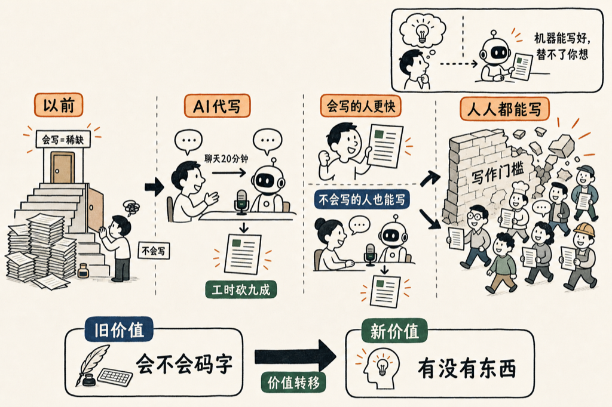

# 会写文章，很快就不是本事了

刚才在乌布，聊着聊着我突然想：这样我也可以写公众号了——我不写，我就聊天，聊完它替我写成文章。

然后再往下想一层：能帮我这么干的东西，也能帮别人这么干。

公众号写手里，有一批人本来就靠"会写"吃饭。他们会来买这个东西——不是因为不会写，是因为本来要憋两小时的一篇，现在聊二十分钟就出来了。**对会写的人，它是把工时砍掉九成。**

更有意思的是另一批人：本来根本不写的人。我身边好多人，一提"写篇公众号"就头大，觉得那是另一个工种，跟自己没关系。可如果写公众号变成"找个人聊聊天"，门槛一下就没了。聊天谁不会？于是他们也会来。

这两批人凑到一块，结论挺吓人的：**人人都可以写文章了。**

我们这代人心里一直藏着一个隐含的排序：会写的人在上面，不会写的在下面。"文笔好"是一种本事，是稀缺的，是能拿来谋生、拿来立身的。这个排序撑了很多年，因为"把想清楚的东西落成通顺的字"这一步，确实卡住了大多数人。

现在卡人的那一步，被机器接管了。

剩下的是什么？是最前面那一截——你得真有一句有意思的话要说，你得真把一件事想清楚了。这部分机器替不了。**它能把你的话写好，但替你想不出那句话。**

所以我不觉得"人人都能写"是把写作拉低了。恰恰相反，它把写作里真正值钱的那部分，从"会不会码字"挪回到了"你脑子里到底有没有东西"。会码字这件事在贬值，有想法这件事在升值。

这是好事。憋了一肚子话、就因为不会写、一辈子没说出口的人，太多了。会写从来不该是一道门槛，它只是一道一直没人拆掉的墙。现在墙塌了，该轮到那句话本身说了算。

<!--RECENT_ARTICLES_START-->
<section style="margin-top:28px;padding-top:16px;border-top:1px solid #e5e5e5;line-height:2.2;font-size:0.95em;"><strong style="color:#ff0000;">扩展阅读</strong> <a class="normal_text_link mp_article_text_link" target="_blank" style="" href="https://mp.weixin.qq.com/s/ARXn7Bp4GcwwDey1K_nyZg" textvalue="这一小段路，可能就是十年" data-itemshowtype="0" linktype="text" data-linktype="2">这一小段路，可能就是十年</a> <a class="normal_text_link mp_article_text_link" target="_blank" style="" href="https://mp.weixin.qq.com/s/qgXBlHSVSgckPF8ITz-p7A" textvalue="在 CLAUDE.md 里养一只金丝雀" data-itemshowtype="0" linktype="text" data-linktype="2">在 CLAUDE.md 里养一只金丝雀</a> <a class="normal_text_link mp_article_text_link" target="_blank" style="" href="https://mp.weixin.qq.com/s/p_frJoLyINOrh5nRqrX1lw" textvalue="三年之后：回看 2023 年我对 ChatGPT 的判断" data-itemshowtype="0" linktype="text" data-linktype="2">三年之后：回看 2023 年我对 ChatGPT 的判断</a> <a class="normal_text_link mp_article_text_link" target="_blank" style="" href="https://mp.weixin.qq.com/s/jM5b0O9cIN7cPCnl6KR0bg" textvalue="AI 能力的三个简单层次" data-itemshowtype="0" linktype="text" data-linktype="2">AI 能力的三个简单层次</a> <a class="normal_text_link mp_article_text_link" target="_blank" style="" href="https://mp.weixin.qq.com/s/-HK2ymNH3bhun-zQ65cmBQ" textvalue="改指令，不要改产物" data-itemshowtype="0" linktype="text" data-linktype="2">改指令，不要改产物</a></section>
<!--RECENT_ARTICLES_END-->
