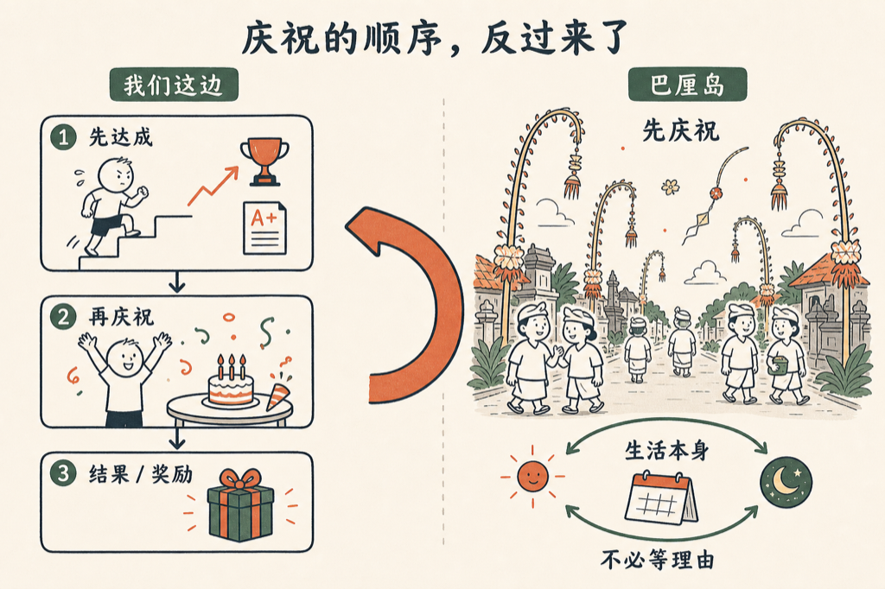

刚从巴厘岛回来。

那边有一件事让我印象很深：他们什么都庆祝，天天都在庆祝各种各样的节日，我都想不出来为什么有那么多事情可以庆祝，而且好像永远庆祝不完。

我去的那天正好赶上一个节日——第二天是 6 月 1 日，所以到处都是装饰。路边插满了长杆，跟电线杆一样高，但顶部是软的，弯成弧形垂下来，像杨柳一样。两侧每隔一段就有一根，明显是花了很多力气做出来的。路上大概有三分之二的男人都穿白衣服，是那种麻布的白 T 恤，短袖短裤，头上还扎着一条白色的头巾。

这个场景看着很舒服。不是因为它有多宏大，就是很放松，很日常，毫无紧张感。

我后来想，巴厘岛人庆祝这件事本身，其实没什么大道理。不是因为今天发生了什么了不起的事，不是因为赚了钱、赢了什么、完成了什么目标。就是：想庆祝，就庆祝。然后天天庆祝。

我们这边庆祝往往是有理由的——要有一个值得庆祝的事，才庆祝。业绩达标了庆祝，升职了庆祝，孩子考了高分庆祝。庆祝是个结果，是个奖励，是对某件事的回应。没有那件事，庆祝就显得奇怪，显得没来由。

但巴厘岛人好像把这个顺序反过来了。庆祝不是因为有了什么，庆祝就是生活本身的一部分，是一种默认状态。今天庆祝，明天还庆祝，不用想太多，就是庆祝。

我觉得这种状态挺难得的。。。

