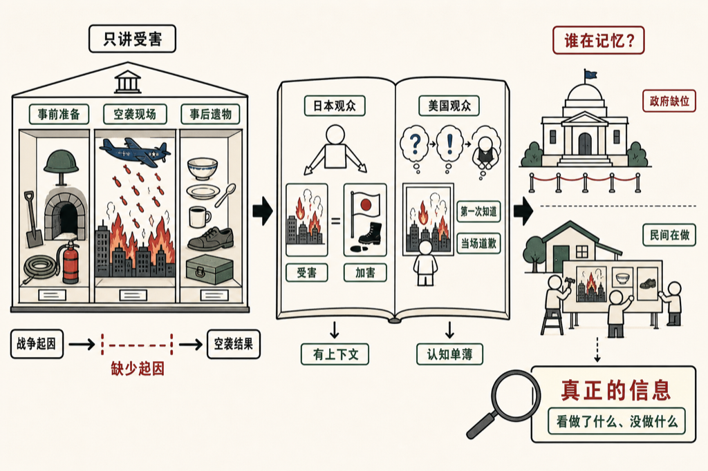

刚去看了日本的中央区空袭纪念馆。

馆里的东西摆得很齐——空袭前的防灾准备、防空洞、消防器械、救援体系；然后是美军的 B-29 轰炸机、那批燃烧弹的实物，讲了大概 325 架飞机，每架带 40 枚大炸弹，每枚里装 38 个小的燃烧单元，手臂长短，像硬币那么扁。然后是事后的餐具、遗物、善后安排。每一项都有数据，每一件都有出处。

客观，相当客观。

但他什么都没讲。没有讲这场轰炸是怎么来的，没有讲战争的前因后果，更没有讲日本自己在海外到底干了些什么。因果链就这么断在那里。轰炸平地里来了，人死了，完。

这种「只讲受害，不讲起因」的叙事方式，我在那边站了一会儿才回过神来——这不是疏忽，这是一种选择。

---

然后我去翻了留言册，反而看到了一些有意思的东西。

日本观众的留言里，有相当一部分会同时提到两件事：日本是这场轰炸的受害国，也是那场战争的加害国。两件事并排写，不回避。这让我有点意外。

美国观众的留言就完全是另一个画风。很多人写的是：「没想到当时美国在日本做了这样的事，我为美国的行为道歉。」满心忏悔，情绪真诚，但那个认知框架非常单薄——好像来之前完全不知道这段历史，参观完了第一次听说，然后当场开始道歉。

这么一比，日本人对这段历史的了解，反而是高于美国人的。不是因为日本教育做得多好，而是日本人至少知道这件事是有上下文的，自己国家不是无辜的起点。

---

顺便一提，这个纪念馆本身也不是政府建的，是民间组织在做。政府在这件事上没做什么，所以民间来填。

我倒觉得这本身也是一种信息——一个国家在战争记忆上做了什么、没做什么，往往比纪念馆里摆了什么更能说明问题。

馆里东西摆得再客观，缺的那半截因果，还是缺的。。。

<!--RECENT_ARTICLES_START-->
<section style="margin-top:28px;padding-top:16px;border-top:1px solid #e5e5e5;line-height:2.2;font-size:0.95em;"><strong style="color:#ff0000;">扩展阅读</strong> <a class="normal_text_link mp_article_text_link" target="_blank" style="" href="https://mp.weixin.qq.com/s/GUk32YZg-1dz3f0mv-JjEA" textvalue="我的十四条 Claude Code 使用经验" data-itemshowtype="0" linktype="text" data-linktype="2">我的十四条 Claude Code 使用经验</a> <a class="normal_text_link mp_article_text_link" target="_blank" style="" href="https://mp.weixin.qq.com/s/rVIdslZq-1B2A3SWWqneNA" textvalue="为什么我们看到 AI 写的东西，就会觉得被冒犯？" data-itemshowtype="0" linktype="text" data-linktype="2">为什么我们看到 AI 写的东西，就会觉得被冒犯？</a> <a class="normal_text_link mp_article_text_link" target="_blank" style="" href="https://mp.weixin.qq.com/s/QKZm26DIGwGjm3McOlkCQw" textvalue="「Agent本质是一个死循环」：一句话告诉你什么是 Agent" data-itemshowtype="0" linktype="text" data-linktype="2">「Agent本质是一个死循环」：一句话告诉你什么是 Agent</a> <a class="normal_text_link mp_article_text_link" target="_blank" style="" href="https://mp.weixin.qq.com/s/-vvqwMWruUwThoY9yaecmg" textvalue="工程师的浪漫" data-itemshowtype="0" linktype="text" data-linktype="2">工程师的浪漫</a> <a class="normal_text_link mp_article_text_link" target="_blank" style="" href="https://mp.weixin.qq.com/s/WHDieFP7zc6iUS8nWVxcwg" textvalue="把 LLM 当编译器，把 Skill 当 App" data-itemshowtype="0" linktype="text" data-linktype="2">把 LLM 当编译器，把 Skill 当 App</a></section>
<!--RECENT_ARTICLES_END-->
