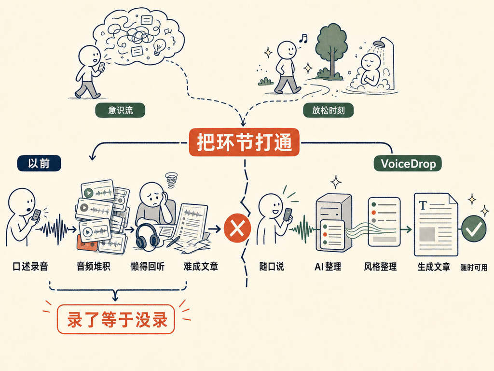

这两天把一个挺多年前就想干的事给做出来了——一个可以直接从口述出文章的 APP，叫 VoiceDrop。

逻辑很简单：平常走路、聊天、或者任何有想法的时候，拿出来，把想法直接说出来，不需要结构，不需要组织，说就完了。服务器端用大语言模型，按照自己的写作风格，把这些口述整理成文章。风格这一块另外有一套方法，可以从历史文章里把自己的风格蒸馏出来。

这件事本身不难，也不新。但是当我做出来自己用了一下，感觉真的挺不一样的。

主要有两个原因。

**第一个，人很多时候是意识流状态。**

你脑子里讲到哪就到哪，并没有那么强的结构性。如果要把它写出来，你得坐在那里正儿八经花时间。但用口述的方式记录，太容易了——尤其是和朋友聊天的时候，随便聊，就把很多灵感给俘获出来了。

**第二个，好的灵感都在你放松的时候出现。**

走路的时候，洗澡的时候，上厕所的时候。这个时候如果没有办法把它记录下来，就稍纵即逝了。

以前我也试过，把这些时刻录下来。甚至专门的硬件设备也用过。但问题在于，你录下来以后，再想回去处理它，基本上不会发生。你会攒很多段录好的音频，然后再也不会听第二遍——因为你知道听一遍要花和录一遍差不多的时间，这是没有意义的。把音频转成字幕文件也几乎不可用，把字幕再改成最终文章，这个过程有时候还不如从头自己重写。

所以录了等于没录。

有了 VoiceDrop 以后，这个环节就直接打通了：口述完，文章出来，随时可用。这是真正不一样的地方。

APP 已经提交 App Store 审核了，过一小段时间应该就可以上线。链接出来我会发。如果想提早拿到测试版，可以发私信给我。

