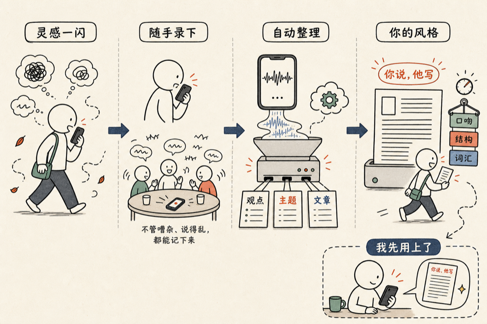

最近做了一个 APP，叫 VoiceDrop。

用法很简单：对着手机说话，或者把手机放在饭桌上录一段朋友聊天，不管现场多嘈杂、说得多乱，他都给你记下来。记完之后，他自动从里面找观点、拆主题，整理成一篇或者几篇文章。

就这样。你说，他写。

这件事对我的意义是：我有很多想法是意识流的，转瞬即逝的那种。坐下来打字，脑子就空了。但跟人聊天、走路发呆、洗澡的时候，反而什么都来了。以前这些想法就这么没了，现在对着手机说两句，他帮我接住。

APP 还支持自定制风格。你把自己的写作风格描述填进去——什么口吻、什么结构偏好、什么词汇习惯——他就按那个风格来整理。所有这些处理都在服务器端跑，你不用操心任何技术细节，说完就走，回头看文章就好了。

我自己就是第一个用户。你现在看到的这篇，就是这么来的。

<!--RECENT_ARTICLES_START-->
<section style="margin-top:28px;padding-top:16px;border-top:1px solid #e5e5e5;"><strong style="color:#ff0000;">扩展阅读</strong> <a class="normal_text_link mp_article_text_link" target="_blank" style="" href="https://mp.weixin.qq.com/s/vXjUudqzLINGFDIxUPxJpg" textvalue="20 年前的程序员，重新学走路" data-itemshowtype="0" linktype="text" data-linktype="2">20 年前的程序员，重新学走路</a> <a class="normal_text_link mp_article_text_link" target="_blank" style="" href="https://mp.weixin.qq.com/s/-HK2ymNH3bhun-zQ65cmBQ" textvalue="改指令，不要改产物" data-itemshowtype="0" linktype="text" data-linktype="2">改指令，不要改产物</a> <a class="normal_text_link mp_article_text_link" target="_blank" style="" href="https://mp.weixin.qq.com/s/QKZm26DIGwGjm3McOlkCQw" textvalue="「Agent本质是一个死循环」：一句话告诉你什么是 Agent" data-itemshowtype="0" linktype="text" data-linktype="2">「Agent本质是一个死循环」：一句话告诉你什么是 Agent</a> <a class="normal_text_link mp_article_text_link" target="_blank" style="" href="https://mp.weixin.qq.com/s/1EAHq2WyweZQ6hWp-rBI7g" textvalue="AI 时代，学动词，别追名词" data-itemshowtype="0" linktype="text" data-linktype="2">AI 时代，学动词，别追名词</a> <a class="normal_text_link mp_article_text_link" target="_blank" style="" href="https://mp.weixin.qq.com/s/Fk65JcazCpv59JePhfaXbQ" textvalue="ccglass 0.6.0 版本新功能" data-itemshowtype="0" linktype="text" data-linktype="2">ccglass 0.6.0 版本新功能</a></section>
<!--RECENT_ARTICLES_END-->
