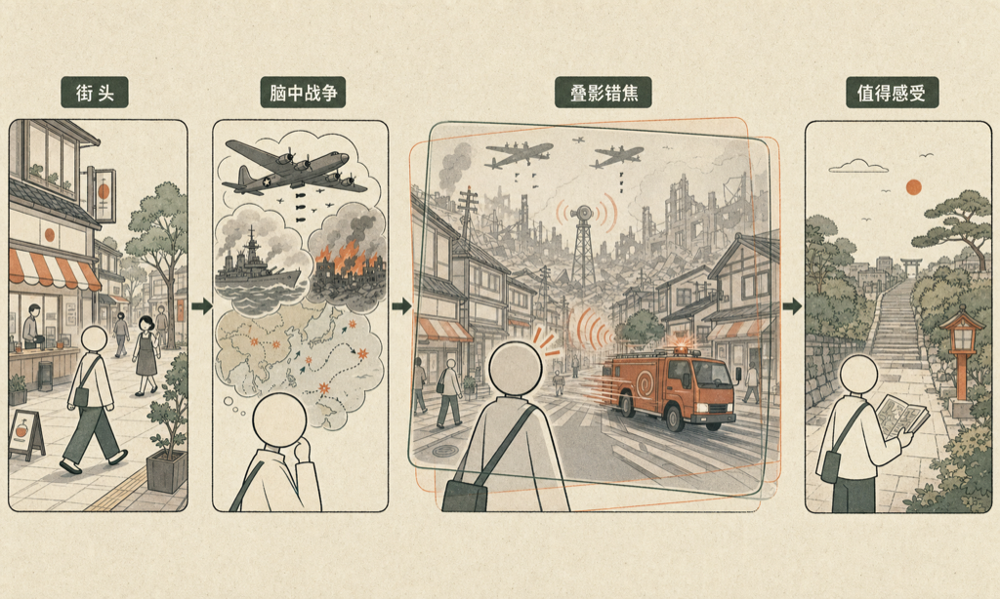

走在日本街头，脑子里挥之不去的是战争。

我最近在看几部和二战太平洋战区有关的东西——南京的纪录片、中途岛海战、珍珠港、东京的杜立特空袭，还有麦克阿瑟来占领日本的那段历史。这些东西堆在脑子里，然后我就带着这一堆东西走在日本的街头。

结果就很割裂。

眼前是干干净净的街道，窗明几净的店面，礼貌有加的路人。脑子里却一直在问：就是这个民族，当年大刀阔斧地扫了整个亚洲——朝鲜、中国、菲律宾、缅甸，当时的国民情绪到底是什么样的？他们进行得那么起劲，后来又是怎么在心理上收场的？

这两件事，我怎么凑都凑不到一起。

那天我去看了一个纪念馆，是关于美军对东京大轰炸的。出来以后走在下町那一片，看着四周一栋栋楼，新楼、旧楼，明显都是 1945 年以后建的。我继续在想：轰炸的时候是什么样子？夷为平地是什么意思？一片废墟然后重建，整个这个过程，那段历史对日本人到底意味着什么？对中国的意味又是什么？中国到底有多少人认真了解过这些历史的来龙去脉？

一连串问题，我都想不清楚。

然后走着走着，听到旁边一辆消防车呼啸而过。就那一声，脑子里冒出来的第一个念头是防空警报——好像美军的 B-29 要飞来了。

当然我知道这是瞎联想。但我想这种联想本身就说明了一些事情：一旦把历史装进脑子，再走进历史发生的那片土地，两件事就会开始互相干扰。城市变成了一张透明的幻灯片，叠在另一张幻灯片上面，两张都是真的，但又对不上焦。

我没能想清楚。也许这种想不清楚本身就是该有的状态——那段历史足够复杂，足够沉，不是走几条街就能捋明白的。

但我觉得应该多花点时间在历史上。不是为了得出什么结论，就是去感受一下，了解一下那些事情真实的来龙去脉。在日本这片土地上走，而脑子里装着那段历史，这种感觉是值得的。

<!--RECENT_ARTICLES_START-->
<section style="margin-top:28px;padding-top:16px;border-top:1px solid #e5e5e5;line-height:2.2;font-size:0.95em;"><strong style="color:#ff0000;">扩展阅读</strong> <a class="normal_text_link mp_article_text_link" target="_blank" style="" href="https://mp.weixin.qq.com/s/0JBu2-SD0K-IvxIAwjCGtw" textvalue="为什么 AI 写的文章一眼就能看穿" data-itemshowtype="0" linktype="text" data-linktype="2">为什么 AI 写的文章一眼就能看穿</a> <a class="normal_text_link mp_article_text_link" target="_blank" style="" href="https://mp.weixin.qq.com/s/L8puybdd9rr_OI3iSnS-dw" textvalue="吃一堑长一智.skill —— 那一秒，是改大脑参数最好的时机" data-itemshowtype="0" linktype="text" data-linktype="2">吃一堑长一智.skill —— 那一秒，是改大脑参数最好的时机</a> <a class="normal_text_link mp_article_text_link" target="_blank" style="" href="https://mp.weixin.qq.com/s/-HK2ymNH3bhun-zQ65cmBQ" textvalue="改指令，不要改产物" data-itemshowtype="0" linktype="text" data-linktype="2">改指令，不要改产物</a> <a class="normal_text_link mp_article_text_link" target="_blank" style="" href="https://mp.weixin.qq.com/s/p_frJoLyINOrh5nRqrX1lw" textvalue="三年之后：回看 2023 年我对 ChatGPT 的判断" data-itemshowtype="0" linktype="text" data-linktype="2">三年之后：回看 2023 年我对 ChatGPT 的判断</a> <a class="normal_text_link mp_article_text_link" target="_blank" style="" href="https://mp.weixin.qq.com/s/-vvqwMWruUwThoY9yaecmg" textvalue="工程师的浪漫" data-itemshowtype="0" linktype="text" data-linktype="2">工程师的浪漫</a></section>
<!--RECENT_ARTICLES_END-->
