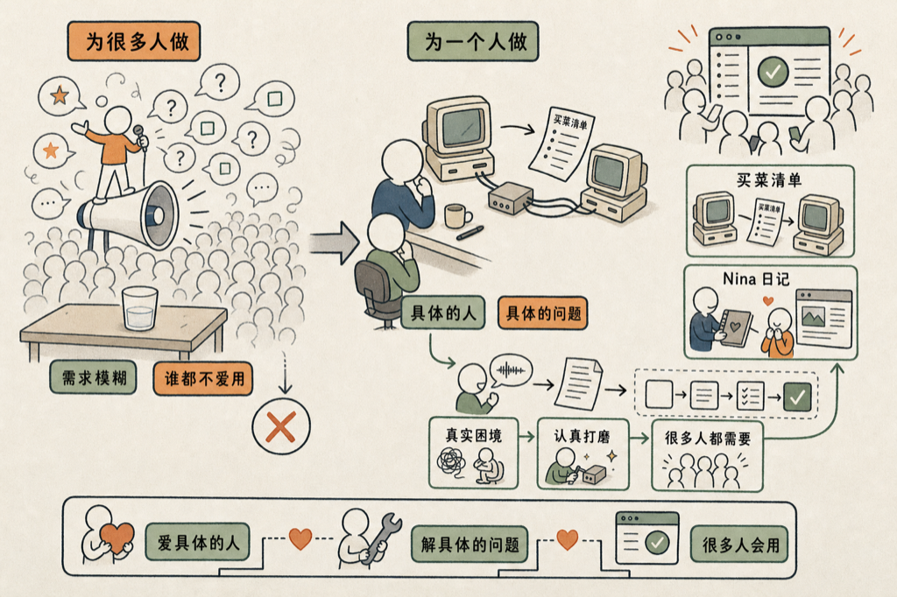

# 为一个人做软件，就会有很多人用

和一个做产品的朋友聊 VoiceDrop 时，她给我说了一句话，让我后来想了很久。

她说，做软件最难的是找到一个具体的人。

我当时说的是：**为一个人做软件，就会有很多人用；为很多人做软件，一个人都不会用。**

这是反直觉的。

正常的产品思维是：用户越多越好，所以目标用户要尽量广。"面向所有有需求的人"。"打通各类场景"。听起来对，但产品做出来，往往像白开水——什么口味都不是，什么人都不喝。

她听完没有反驳，而是说：你知道有很多故事吗？

然后她给我讲了 Cisco 的起源。

Stanford 有两位教授，是夫妻，在两个不同的教研室工作。他们用两套不同的系统，每天发买菜清单，发不过去。所以就做了个小盒子，把两个系统连起来。

就这么一件事——**两个人之间发不过去的买菜清单**——成了 Cisco 的起点。

公司名字也有来历。他们当时参与了金门大桥的项目，觉得这个公司就是在两人之间徘徊创立的，于是截了 San Francisco 的尾巴，叫 Cisco，logo 就是金门大桥的剪影。

一个价值数千亿美元的公司，最初解决的问题是：我老婆的消息发不到我的电脑上。

她还给我讲了另一个故事：有一款写了 10 年的博客软件，最早是一个工程师给自己的爱人 Nina 做的。

**她记日记，他想让她记得更方便。**

就这么一个出发点，做出来一款软件，后来很多人用了很多年。

她最后总结了一句：基本上重要的这些 app，都是带着爱的工程师的浪漫。

我觉得这句话说到了一个很底层的东西。

"为一个人做"这件事，逼着你把所有含糊的需求都变得清晰。你没有办法说"用户可能需要"或者"场景各有不同"。你面对的是一个具体的人，具体的困境，具体的某天某件事搞不定。

模糊是奢侈品，具体才是答案。

为了一个真实的人做，你自然会做得有质感、有温度。没有人会认真打磨一个为"18-35 岁有购买力的年轻用户"做的功能，但很多人会认真打磨一个让老婆的消息能发到自己电脑上的小盒子。

**爱一个具体的人，才会解决一个具体的问题。**

我那个朋友做的是 VoiceDrop——一个把语音消息转成文字、整理进工作流的工具。她讲完这些故事，笑着说：所以我就挖你的需求就够了，哈哈哈，其他人我都先不管。

她把这个道理用在了自己做的事上。

我想，很多好产品的秘密就是这样：不是从市场调研开始的，是从某一个人的某一件搞不定的事开始的。

然后有人恰好解决了。

然后很多人发现，这正是他们要的。

<!--RECENT_ARTICLES_START-->
<section style="margin-top:28px;padding-top:16px;border-top:1px solid #e5e5e5;"><strong style="color:#ff0000;">扩展阅读</strong> <a class="normal_text_link mp_article_text_link" target="_blank" style="" href="https://mp.weixin.qq.com/s/jM5b0O9cIN7cPCnl6KR0bg" textvalue="AI 能力的三个简单层次" data-itemshowtype="0" linktype="text" data-linktype="2">AI 能力的三个简单层次</a> <a class="normal_text_link mp_article_text_link" target="_blank" style="" href="https://mp.weixin.qq.com/s/vowe7sYnZbxNowc8h7GUAQ" textvalue="AI 时代，Python 已经是新的&quot;汇编语言&quot;了" data-itemshowtype="0" linktype="text" data-linktype="2">AI 时代，Python 已经是新的&quot;汇编语言&quot;了</a> <a class="normal_text_link mp_article_text_link" target="_blank" style="" href="https://mp.weixin.qq.com/s/L8puybdd9rr_OI3iSnS-dw" textvalue="吃一堑长一智.skill —— 那一秒，是改大脑参数最好的时机" data-itemshowtype="0" linktype="text" data-linktype="2">吃一堑长一智.skill —— 那一秒，是改大脑参数最好的时机</a> <a class="normal_text_link mp_article_text_link" target="_blank" style="" href="https://mp.weixin.qq.com/s/p_frJoLyINOrh5nRqrX1lw" textvalue="三年之后：回看 2023 年我对 ChatGPT 的判断" data-itemshowtype="0" linktype="text" data-linktype="2">三年之后：回看 2023 年我对 ChatGPT 的判断</a> <a class="normal_text_link mp_article_text_link" target="_blank" style="" href="https://mp.weixin.qq.com/s/rVIdslZq-1B2A3SWWqneNA" textvalue="为什么我们看到 AI 写的东西，就会觉得被冒犯？" data-itemshowtype="0" linktype="text" data-linktype="2">为什么我们看到 AI 写的东西，就会觉得被冒犯？</a></section>
<!--RECENT_ARTICLES_END-->
