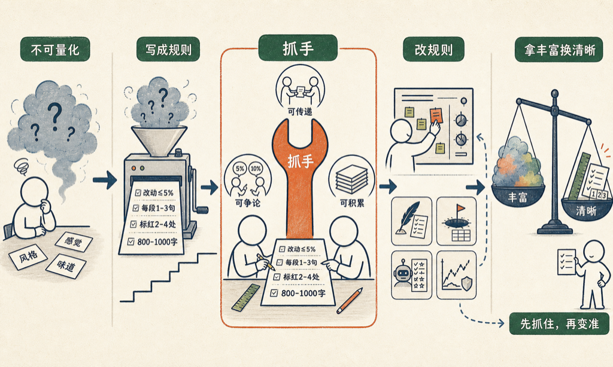

# 把不可量化的东西量化的美妙之处

一件事一旦被量化，就从玄学变成了工程。

「写作风格」听起来是最不可量化的东西了吧。什么叫「像我写的」？是语气？是节奏？还是某种说不清的味道？

我现在的做法是，把它写成一个文件。里面全是数字和规则：

- 润色时改动不超过原文的 5%
- 每段 1 到 3 句话
- 全文标红 2 到 4 处，只用纯红
- 默认 800 到 1000 字，超过 1500 字一定是哪段在撑场

AI 读了这个文件，写出来的东西就有八分像我。

更美妙的是后面这件事：每次我觉得「味道不对」，我不去改那篇文章，我去改这个文件——逼自己把那个说不清的「味道」，再挤出来一条规则。

文章会过时，规则会留下。

同样的事我做过好几次。「教训」也是不可量化的东西，我把每次踩的坑固定成五行：堑是什么、当时的自动反应是什么、旧的权重是什么、新的参数是什么、下次的那一秒怎么做。「AI 写得好不好」也是玄学，我给它做了一套评分题，每改一版 prompt 就跑一遍分数。

量化的美妙，不在于数字有多准，而在于三件事：

- 可以传递。「凭感觉」传不给别人，「5%」可以。
- 可以争论。你觉得该是 10%？好，我们终于有了一个可以吵的东西。
- 可以积累。感觉会忘，规则只增不减。

这不是什么新发明。菜谱把「火候」写成「中火三分钟」，音乐把「快一点」写成 BPM 120，健身教练把「练得差不多了」写成三组十二次。硅谷更狠，把「用户到底爱不爱你」这么幽微的感情，压成一个叫 NPS 的数字，从负一百到一百，所有公司拿它开会。

当然有损失。「中火三分钟」不是火候的全部，5% 也不是我语气的全部。每次量化，都是拿丰富换清晰。

但我越来越觉得这个交换划算。没有数字的时候，两个人只能互相说「我觉得」，说完谁也说服不了谁；有了数字，哪怕这个数字是错的，大家终于有了一个可以一起改的东西。

量化不是给答案的，是给抓手的。

先抓住，再慢慢让它变准。

