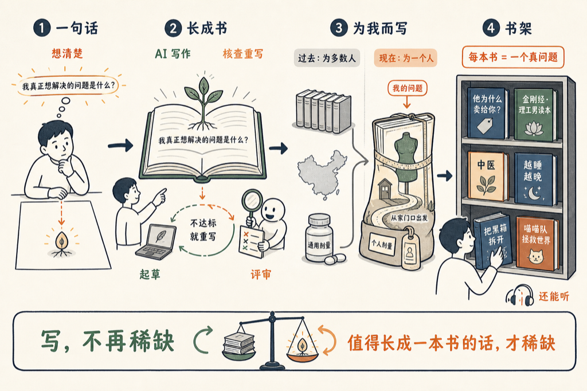

# 写一本自己的书

我有一个书架，上面放着四十多本书，作者都是我。

先说实话：字不是我一个字一个字敲出来的。每本书从我的一句话长出来，AI 写作代理起草，另一个独立的评审代理核查事实、评估有没有新意和趣味，不达标就打回去重写。我做的事情只有一件：把那句话想清楚。

举个例子。《他为什么卖给你？》整本书，从下面这句话长出来：

<blockquote style="border-left:3px solid #d0d0d0;padding:8px 14px;margin:0;color:#666;background:#f7f7f7;">你买的每一股股票，不是从货架上拿下来的，而是从另一个人手里买回来的。所以要想一想，他为什么卖给你？</blockquote>

十二章，一个下午能读完。这本书写完，我在股票市场上最重要的几个决定，就自动做完了。

**书架上还有些什么？**

- 《金刚经 · 理工男读本》——用工程师听得懂的方式，把这部经拆开讲一遍。
- 《中医》——它是什么，以及为什么很多时候人们觉得它有效。
- 《越睡越晚》——为什么睡觉时间会一天天往后漂。
- 《把黑箱拆开》——手搓一个大语言模型，看看里面到底是什么。
- 《喵喵队拯救世界》——一本小说，写着玩的。

题材看起来很杂，其实只有一个共同点：每一本，都是我当时真的想弄明白的一件事。

以前的书，是为一万个读者写的。出版社要算印量，作者要照顾最大公约数，你真正关心的那个具体问题，书里常常只占半章。

现在可以反过来：书为一个读者写。就像衣服，成衣是为标准身材做的，定制是为你这个人做的；就像地图，书店里卖的是全国交通图，我要的是从我家门口到那个问题的路线图；就像药，药厂配的是大多数人的剂量，而这一副，是照着我的问题抓的。

写一本书，曾经是人生大事：签出版社、三审三校、印刷发行，一个人一辈子能写出一两本，就很了不起了。现在，写一本书的成本降到了——认真想清楚一句话。

稀缺的东西换了位置。写，不再稀缺；那句值得长成一本书的话，才稀缺。

丑话说在前面：这些书没有经过出版社的编辑，毛边一定有，评审代理再严格，也会漏。我自己读的时候，也常常顺手改。

从今天起，这些书还能听了。打开任何一章，点一下「听本章」，几个声音不同的人，把这一章读给你听。

书架在 jianshuo.dev/voicedrop/books，欢迎来翻翻。

更欢迎的是，你去写一本自己的书。

