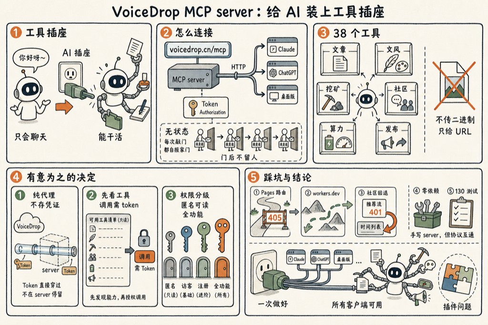

我给 VoiceDrop 做了一个 MCP server。今天说说它是什么，怎么接，以及几个我做的时候有意为之的决定。

先说 MCP 是什么。一句话：给 AI 装一个工具插座。没插之前，AI 只会聊天；插上以后，他能动手干活——读你的文件、调你的接口、替你做事。

这个 server 干的事，就是把 VoiceDrop 整个账号包成这样一个插座。Claude Code、Claude 桌面版、ChatGPT，任何支持 MCP 的客户端连上以后，就能读写文章、改文风、触发挖矿、逛社区、投币、查算力、发公众号。不用再手搓 curl 了。

**它长什么样？**

端点就一个 URL：

<section style="background:#f6f8fa;border-radius:6px;padding:14px 16px;overflow-x:auto;font-family:Menlo,Consolas,monospace;font-size:14px;line-height:1.8;color:#24292e;">https://voicedrop.cn/mcp https://jianshuo.dev/voicedrop/mcp（同一个东西）</section>

传输用的是 streamable HTTP，无状态。每个 POST 自成一体，server 不记 session。你可以想象成每次敲门都自报家门，说完事就走，不留下来喝茶。

接法也简单。在 VoiceDrop App 的「设置 → 账户 → 访问令牌」里复制 token，然后：

<section style="background:#f6f8fa;border-radius:6px;padding:14px 16px;overflow-x:auto;font-family:Menlo,Consolas,monospace;font-size:14px;line-height:1.8;color:#24292e;">claude mcp add voicedrop --transport http https://voicedrop.cn/mcp \ &nbsp;&nbsp;--header "Authorization: Bearer &lt;你的 token&gt;"</section>

其他客户端就填 URL，再加一个自定义头 `Authorization: Bearer <你的 token>`，一样。

**38 个工具**

连上以后，AI 手里有 38 个工具：

- **文章**：列、读、写、看历史版本、回滚、删除
- **文风**：读、写、偷师采样、服务端蒸馏
- **挖矿**：触发挖矿、单篇重挖
- **社区**：刷 feed、看帖、回复、分享、投币
- **算力**：查余额、查账单
- **发布**：生成分享链接、发公众号草稿、出小红书素材包

有几件事我**有意不做**：音频和照片的二进制上传下载。几 MB 的 base64 塞进模型上下文是灾难，这事 App 已经干得很好了。这里只给「列出」和「拿公开 URL」。

**几个有意为之的决定**

第一个，server 是纯代理，不持有任何凭证。你的 token 原样透传给 VoiceDrop，服务端不落盘、不缓存。凭证这个东西，经手的人越少越好。

第二个，`initialize` 和 `tools/list` 不需要 token——客户端得先看得见有什么工具，才谈得上用。只有 `tools/call` 必须带。

第三个，匿名 token 也能用，只是不能写社区、不能投币。四种 token 权限不一样，从「只能看」到「全功能」，按你给的是什么来定。

**几个踩过的坑**

为什么放在 Pages Function 里，而不是单独的 worker？因为 `voicedrop.cn` 是备案接入点，前面挡着一台腾讯云的机器做反代，只把特定路径透传过来。落在 Pages 的 `/voicedrop/mcp` 下面，`voicedrop.cn/mcp` 直接就能用，不用去碰那台随时可能释放的机器。

为什么 agent 出站要走 `workers.dev`？Pages Function 调同 zone 的 `/agent/*` 会先撞上 Pages 自己的路由，POST 直接被 405 掉。这个坑之前踩过一次，这次又踩了一次。

社区 feed 为什么有回退？reco worker 没设密钥，只认匿名 token，登录态的 JWT 打过去会 401。所以 401 的时候回退到时间序列表——这也正是 App 自己的兜底策略。

整个源码零依赖。因为它要跟着 Pages Function 一起被打包，不能引 Node 内置模块。官方 SDK 只在测试里当真客户端用——用它连我们手写的 server，证明协议是真能互通，而不是自说自话。130 个测试，包括这一关。

MCP 这个协议好就好在，它把「AI 能干什么」这件事变成了插件问题。工具做好一次，所有客户端都能用。插座装好了，接下来就看你想让 AI 替你干什么了。

<!--RECENT_ARTICLES_START-->
<section style="margin-top:28px;padding-top:16px;border-top:1px solid #e5e5e5;"><strong style="color:#ff0000;">扩展阅读</strong> <a class="normal_text_link mp_article_text_link" target="_blank" style="" href="https://mp.weixin.qq.com/s/pem86t5ExvJQQhefCgQF-Q" textvalue="「有用」和「好像有用」是两回事" data-itemshowtype="0" linktype="text" data-linktype="2">「有用」和「好像有用」是两回事</a> <a class="normal_text_link mp_article_text_link" target="_blank" style="" href="https://mp.weixin.qq.com/s/6BGxh12jFZG14mrrzxCdOQ" textvalue="到底该不该用 AI 写文章？" data-itemshowtype="0" linktype="text" data-linktype="2">到底该不该用 AI 写文章？</a> <a class="normal_text_link mp_article_text_link" target="_blank" style="" href="https://mp.weixin.qq.com/s/ARXn7Bp4GcwwDey1K_nyZg" textvalue="这一小段路，可能就是十年" data-itemshowtype="0" linktype="text" data-linktype="2">这一小段路，可能就是十年</a> <a class="normal_text_link mp_article_text_link" target="_blank" style="" href="https://mp.weixin.qq.com/s/cWGPLuqCb51XBkl48VINfw" textvalue="AI 写作让我们失去的，我接受" data-itemshowtype="0" linktype="text" data-linktype="2">AI 写作让我们失去的，我接受</a> <a class="normal_text_link mp_article_text_link" target="_blank" style="" href="https://mp.weixin.qq.com/s/L8puybdd9rr_OI3iSnS-dw" textvalue="吃一堑长一智.skill —— 那一秒，是改大脑参数最好的时机" data-itemshowtype="0" linktype="text" data-linktype="2">吃一堑长一智.skill —— 那一秒，是改大脑参数最好的时机</a></section>
<!--RECENT_ARTICLES_END-->
