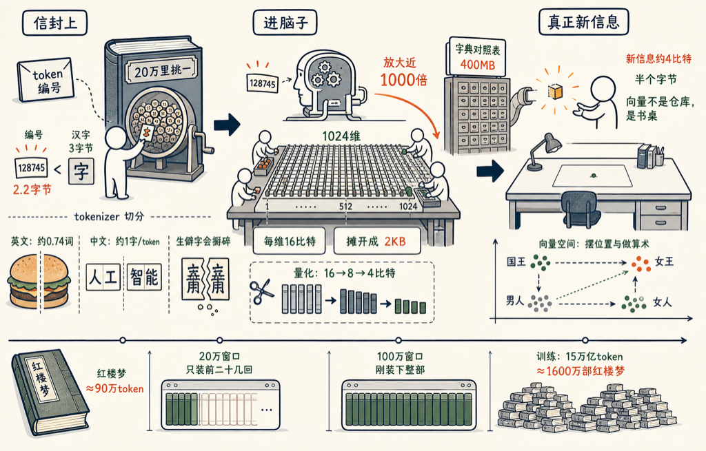

AI 按 token 收费，按 token 思考，按 token 一下一下往外蹦字。可一个 token 到底是多大一块东西？我今天真的去量了一下。

量完发现，这个问题有两个答案，差了一千倍：在信封上，一个 token 只有 2.2 个字节，比一个汉字还小；可一进模型的脑子，他就摊开成 2 KB。

两个答案都对。我一层一层讲。

**第一层：token 是字典里的一个编号**

token 不是字，也不是词，是模型自己那本「字典」里的一个编号。GPT 现在这本字典里有 20 万个条目。他每说一下，就是从这 20 万个里挑一个出来，再挑一个，一个接一个。

从 20 万个里挑一个，是多少信息呢？`log2(200000) ≈ 17.6 比特`，也就是 2.2 个字节。而一个汉字存在电脑里（UTF-8）要 3 个字节。所以单看编号，token 确实比汉字还小。

那一个编号能对应多少文字？我拿真文本喂给 tokenizer 量了：

- 英文：一个 token 平均对应 3.9 个字母、0.74 个单词。hamburger 被切成 hamb + urger，两口。
- 现代中文：差不多一个 token 一个汉字。「人工智能」是两个 token：「人工」+「智能」。
- 文言文：一个 token 只合 0.81 个汉字。生僻字最惨，「葫芦庙」的「葫」要掰成两个 token 才咽得下去。

常用的整口吞，生僻的掰碎了咽——这就是 tokenizer 的全部秘密。

有了换算，就可以和名著比了：

| 作品 | 折合 token |
|------|------|
| 论语 | 2 万 |
| 战争与和平（英文版） | 80 万 |
| 红楼梦 | 90 万 |

Claude 平时的上下文窗口是 20 万 token。你把整部红楼梦扔给他，他一口只含得住前二十几回，大概到宝黛共读西厢那一带。开到最大的 100 万窗口，才刚好装下一整部。

按牌价 3 美元一百万 token 算，让他通读一遍红楼梦，不到 20 块人民币。

**第二层：编号进了脑子，变成 1024 个维度**

现在讲另一个答案。编号只是信封上的地址，模型拿到之后干的第一件事，是查一张大表，把这个编号换成一个向量——一长串数字。

这串数字有多长？小一点的模型是 1024 个，Llama 3 是 4096 个，当年的 GPT-3 是 12288 个。就用 1024 说事：一个 token 进了脑子，就变成了 1024 个数。这 1024 个数，就是常说的「1024 个维度」。

每个维度是多少比特？每个维度就是一个数，通常用 bf16 格式存：16 个比特——1 个管正负，8 个管数量级，7 个管精度。于是：

`1024 维 × 16 比特 = 16384 比特 = 2 KB`

信封上 2.2 个字节的一个 token，在脑子里摊开成 2 KB，放大了差不多一千倍。GPT-3 的 12288 维更夸张，一个 token 摊开是 24 KB。

那张查询用的大表本身也吓人：20 万个编号，每个配 1024 个维度，每个维度 16 比特——光这张「字典对照表」就是 400 MB。这还只是模型的第一层。

顺便说一句，业界所谓「量化」，就是嫌 16 比特太肥，把每个维度砍到 8 比特、甚至 4 比特。4 比特意味着每个维度只剩 16 个刻度，居然大体还能用——可见这 2 KB 里水分不小。这是后话。

**为什么要 1024 个维度？**

因为这串数字不是用来「存」的，是用来「摆」的。每个 token 是这个 1024 维空间里的一个点，意思相近的词，点就挨得近。这个空间还能做算术：国王 − 男人 + 女人，落点就在女王附近。

维度多，不是为了多装信息，是为了给各种「意思的方向」留位置：一个方向管性别，一个方向管时态，一个方向管「是不是食物」……1024 个方向一起用，才摆得开人类语言里那么多纠缠在一起的含义。往后每过一层，注意力机制还会把上下文一点点揉进这个向量——同一个「苹果」，在「吃苹果」和「苹果发布会」里，会被揉到空间里两个不同的位置去。

**最后说一个费曼会喜欢的怪事**

容器越来越大：编号 17.6 比特，向量 16384 比特。可香农在 1951 年就测过，英文每个字母的真实信息量只有 1 比特左右。换算下来，一个 token 真正带来的新信息，只有 4 比特上下——半个字节。

4 比特的新信息，配一张 2 KB 的工作台。这不浪费吗？不浪费。你写一个字也只要一秒钟，但你需要一整张书桌。向量不是仓库，是书桌——桌面大，不是因为东西多，是因为摊开了才好干活。

训练则是另一个量级的事。Llama 3 公开的数字是拿 15 万亿 token 喂出来的，相当于 1600 万部红楼梦。一个人一天读完一部（这已经不是人了），也要读 4 万 5 千年。

所以下次看他一下一下往外蹦字的时候，你知道每蹦一下：信封上是 20 万里挑一的一个编号，2.2 个字节；脑子里是一张 1024 维、2 KB 的桌子在腾挪；而真正送到你眼前的新东西，只有半个字节。

九十万下，就是一部红楼梦。

